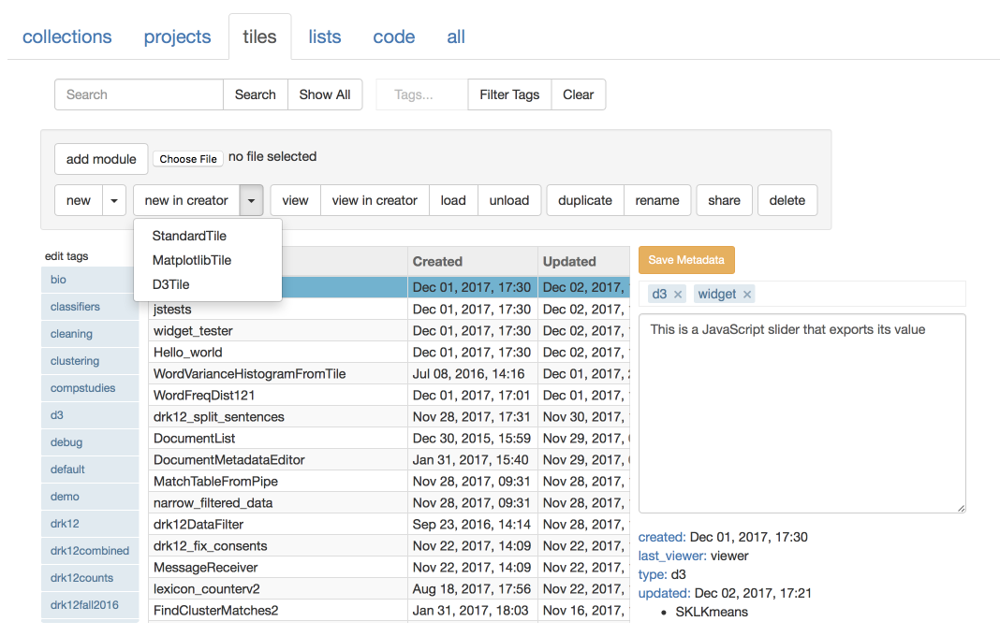
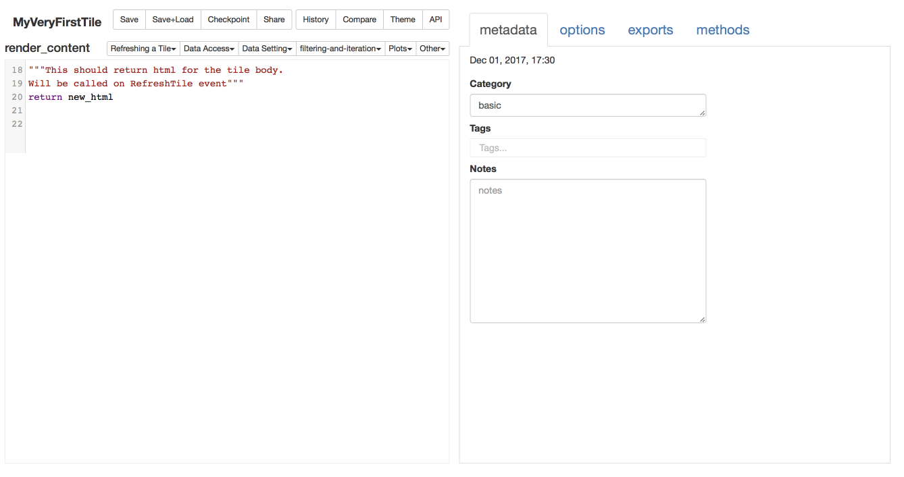
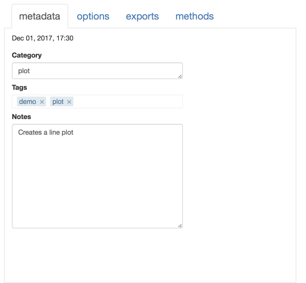
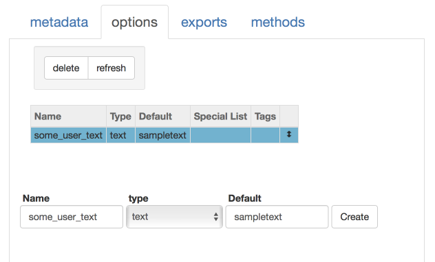

The Tile Creator is the  editor that provides a more scaffolded environment for creating and
editing tiles. As explained in the [introduction to making tiles](Making-Tiles), **the tile creator
is new and can garble existing tiles**. So, use it with care. 
When editing an existing tile you might wnat to first make a copy of the tile.


## Creating the new tile

With that said, here's how to create a new tile with the creator:

Go to the **tiles** tab of your resource library and click **new in creator: StandardTile**. 



When prompted give your tile some sort of useful name. Then you should see something that
looks like this:




## Writing the tile body
The large box on the left-hand side is where you write the code that will be the `render_content` method
in your new tile. In short, what you need to understand is that this bit of python code must return the html
that will be displayed in your tile. Thus, the last line in the box should be a `return` statement.

So, for example, if you change the content of the box to be:

```python
new_html = "hello world"
return new_html
```
Then you will have a tile that simply prints "hello world" on its face.

Remember that the text you display can be any valid html and will be displayed as such. 
So, for example, if you instead write this:

```python
new_html = "<b>hello world</b>"
return new_html
```

Then you'll instead have a tile that display "hello world" in bold text.

In writing your tile, you have access to a number of tactic-specific commands that, for example, give you access
to your data. These are described in some detail here: [Tile Commands](Tile-Commands). 
There is also some help pertaining to these commands built into the Creator window. If you click on
"Show API" at the top fo the Creator view the resource area will be replaced by a compressed version of
the command documentation. Also, at the very top of the big box for typing your code are popup lists 
that contain the tile commands. These paste the relevant command directly into your code.

You can use these [Keyboard Shortcuts](Module-Viewer-Keyboard-Shortcuts) within the box containing your code.

Finally, typing **ctrl-space** while in the code area brings up the autocomplete widget. 
This will prompt you with various useful possibilities, including the Tile Commands

You can also import and make use of a number of scientific libraries including 

* nltk
* numpy
* matplotlib
* sklearn
* gensim

Go to the relevant web sites for documentation on these libraries.

## Specifying tile resources

The area on the right-hand side of the interface allows you to create and edit various resources 
and metadata for your tile.



### metadata

The **metadata** is where you specify a bit of metadata for your tile. 
The "Category" field determines the menu under which your tile will appear in the main project environment.

### options

The **options** tab is where you specify [Tile Options](Tile-Structure#options) that will appear on 
back of your tile. Here I have clicked on the options tab and then used the form at the bottom
to create an option called "some_user_text".




These option can now be referred to in the tile code as `self.some_user_text`. 
So if you then change your code to be:

```python
new_html = "<b>" + self.some_user_text + "</b>"
return new_html
```

There are many different types of options as described here: [Tile Options](Tile-Structure#options). 
there's an extra step required in making use of some of these options
(**list_select**,  **pipe_select**, **function_select**, **class_select**). In these options, the variable you 
get contains only the name of the selected resource. To extract the value you have to use one of the tile 
commands described [here](Tile-Commands#other). For example `self.get_user_list(list_name)` returns the actual
list referred to.

### exports
You can also specifythe name of variables that will be **exports** for your tile. (Exported variables are 
available as pipes to other tiles. Note that these must be instance variables assigned values in your code
in this manner `self.variable_name =  ...`. )

### methods

The **methods** tab displays additional methods defined within a tile class. 
This is for advanced users. But if you use the tile creator to look at existing 
tiles they will often have methods that are visible here. You can define new methods that will be accessible in
your tile. For example, you could define a method `my_method` like so:

```python
def my_method(self, avar):
    return myvar + 2
```

All methods that you define need to have `self` as the first argument. 

# Creating Matplotlib Tiles

You can use the Tile Creator to make tiles that display matplotlib figures. If you open an existing
matplotlib figure or create a new one from your resource manager, then the Tile Creator opens
with a slightly different interface. Rather than having one large box for code on the left, there
are two. The bottom one holds the code for the `render_content` method. The other holds the
code for the `draw_plot` method, which all matplotlib tiles must have. 

This is explained a bit [here](Matplotlib-Tiles).

# Creating D3 Tiles

You can also use the Tile Creator to make tiles that display interactive D3 figures. If you open an existing
D3 figure or create a new one from your resource manager, then the Tile Creator opens
with a slightly different interface. Rather than having one large box for code on the left, there
are two. The bottom one holds the `render_content` method. The top one holds a javascript function 
which must be of the form:

```javascript
function (selector, w, h, arg_dict) {
}
```
Also, `render_content` must return a dictionary of arguments that will be passed to the javascript
function in `arg_dict`.

This is explained a bit [here](D3-Tiles).

