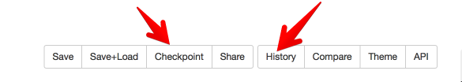
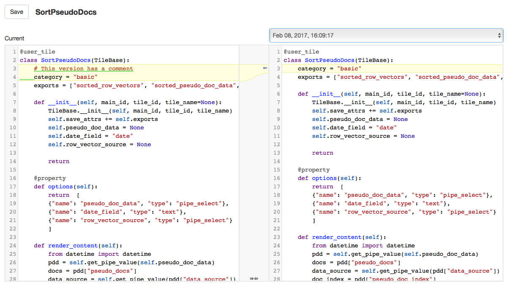

## Version History

There is now machinery built into Tactic that helps you to look at and use code from earlier versions of a tile.
This is partly automatic and partly manual. First the manual part: In the Module Viewer and Tile Creator there
is now a button that says **Checkpoint++. Clicking on of this buttons saves the tile as usual. 
But it also will cause Tactic to permanently save a snapshot of the tile code as 
it appears at the moment of the save. 

Tactic also tries to do some semi-intelligent saving of snapshots automatically. Every time that a tile is saved,
Tactic will save a snapshot of the tile. However, this set of automatically generated snapshots is regularly
pruned in a particular way: Every time that a tile is opened in the Module Viewer or the Tile Creator, Tactic looks 
at all snapshots that are older than one day ago, and it only keeps the last version of a tile that was saved on a
given day. So you'll only end up with at most one snapshot of a tile per day. 
This pruning doesn't affect manually created snapshots.

To access the history, you click the **History** button in one of the tile viewers  This is what it looks like,
in all it's glory. 

The popup list at the top right allows you to browse through old versions of the tile. 
Differences are highlighted and you can copy code from old versions to the current tile. 
(You have to click Save for any changes to be saved.)

## Compare Tiles

You can also compare two tiles. Clicking on the **Compare** button brings up a window that is similar to the
history viewer. It has a popup on the right hand side that you can click to choose any tile from your library to 
compare to the current tile.