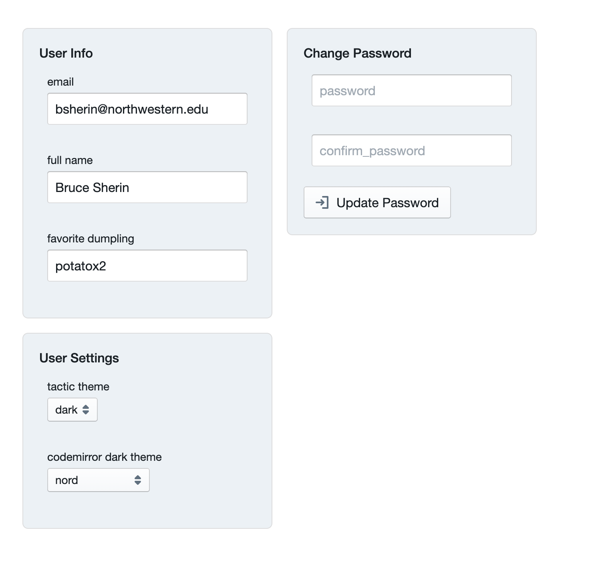
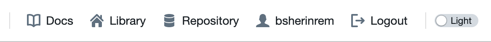
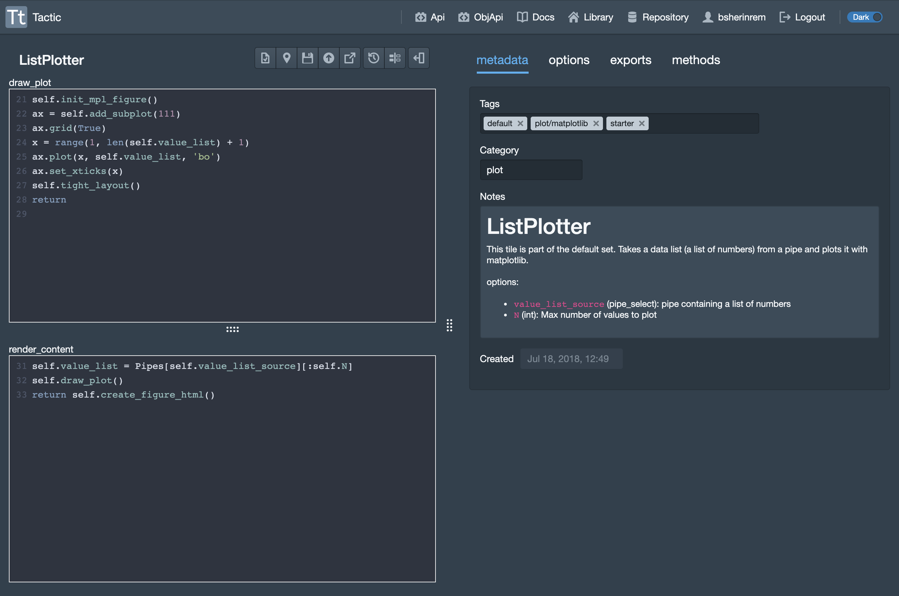
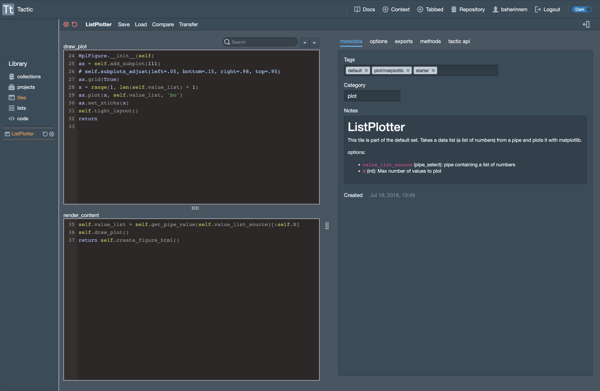

Settings and Themes
=================================

If you click on your username at the top right of the toolbar, you'll be taken to the account interace.

(Note that your dumpling preferences will not be shared with any third parties.)

I think this is pretty much self-explantory except, perhaps, for the tactic theme and the codemirror dark theme.

Dark Theme
----------

The "tactic theme" setting sets the global mode of tactic to either dark or light. If you change the setting, you won't see any
immediate change. To see the change in this window, or any other, you'll need to refresh the window. However, you can
always use the theme switch at the top right of the toolbar to instantly change both the theme of the current
window as well as the user settings.

Here is a sample of what the dark theme looks like, in all of its glory:

Codemirror Dark Theme
---------------------

The codemirror dark theme setting, which is only settable from the account interface, is something different. I know
that the naming is confusing, but it is what it is.

This setting controls what syntax coloring and styles that will be used when displaying code, while using the dark
theme. (At present there is only one codemirror theme available for the tactic light theme.)

For these changes to take effect you will need to reload any open windows.

Here, for example is what code looks like with the pastel-on-dark theme:

