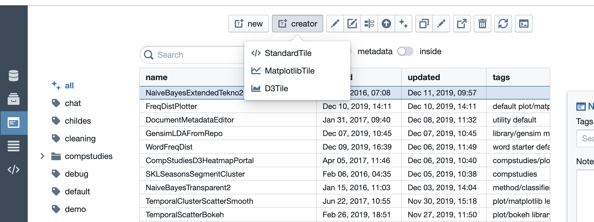
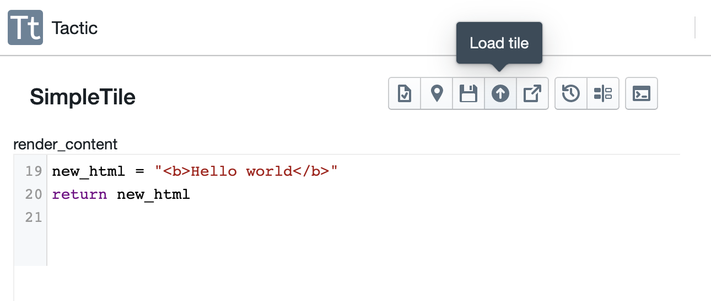
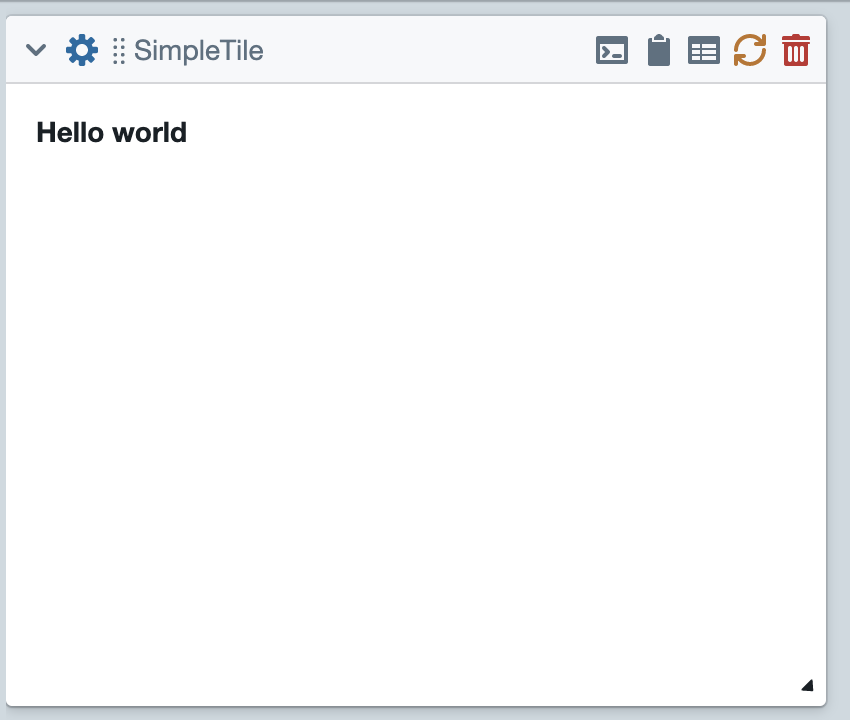
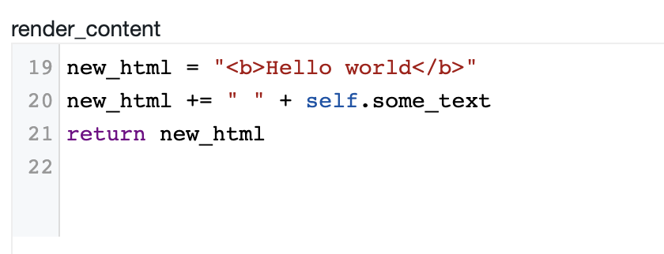
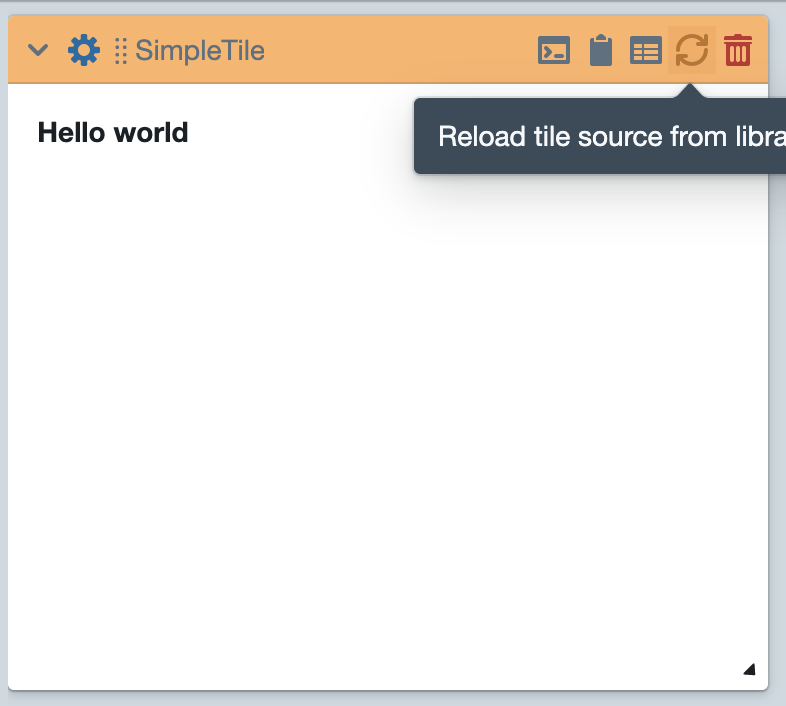
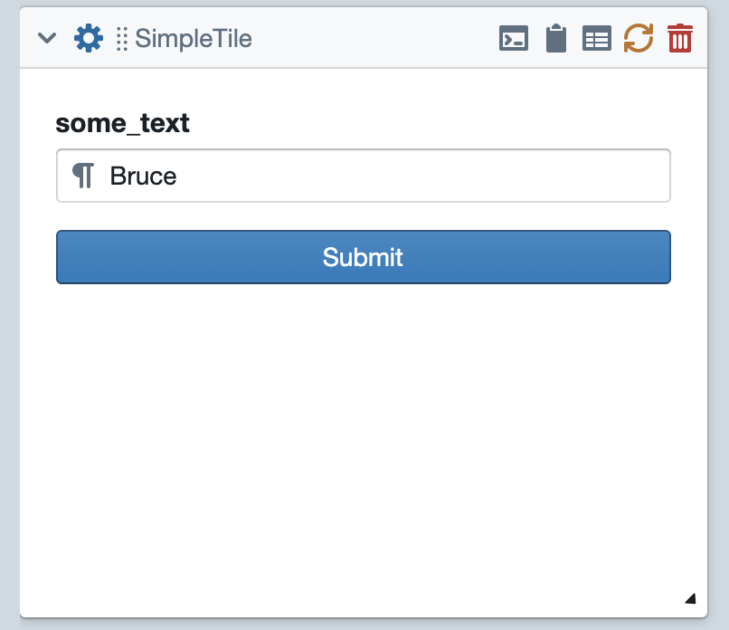
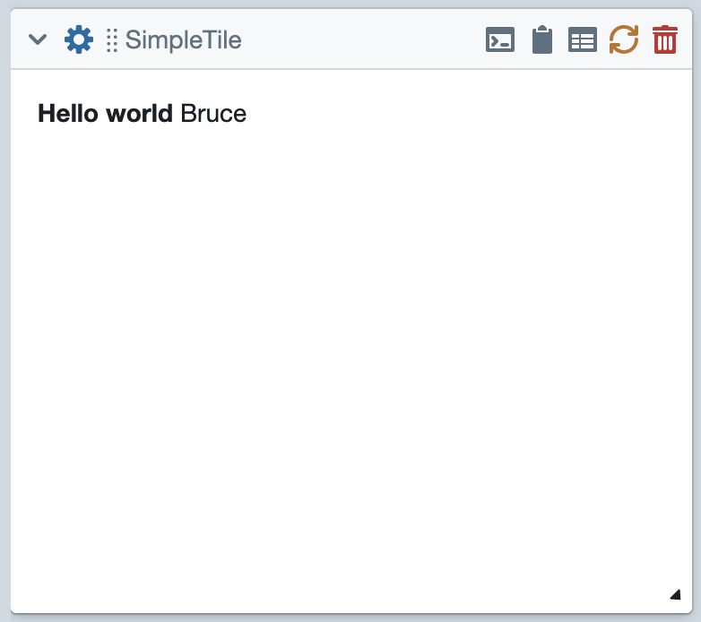
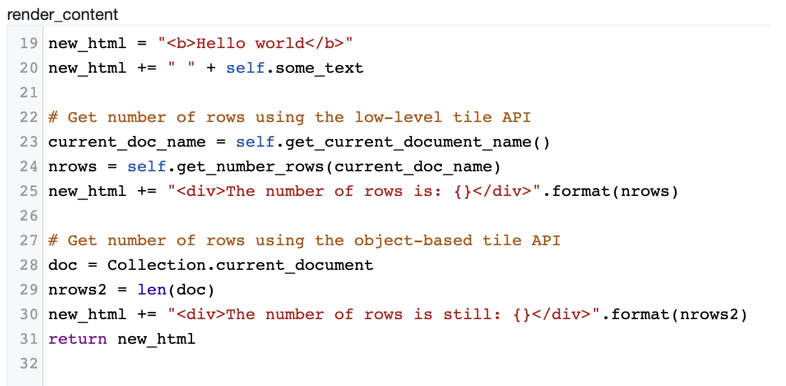
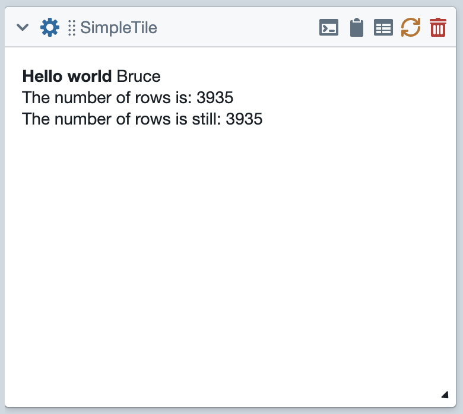

Create A Simple Tile
====================

The purpose of this tutorial is to walk you through the basics of creating a simple tile.
The first step is to go to the tiles pane of your library. Then create a StandardTile in
the creator as shown below.

You'll be asked to give this tile a name. Then you'll be dropped into `Tile Creator <Tile-Creator.html>`__.
At this point, you've already created a functional tile. The code you see is the content of the ``render_content``
method of your tile. The job of ``render_content`` is to return a string consisting of html that will be displayed
on the front of the tile.

In its current state, this tile does something very minimal.
It first assigns some text to the variable ``new_html``.
Then it returns this variable. Note that the string returns includes some very simple html markup. The text displayed
on the tile is wrapped in ``<b>`` tags, which will cause the text to be displayed as bold.

At this point, you can click on the :guilabel:`load` button (see the above image). The tile should then be available for
use within a project. So, go to the collections pane in your library. and load a data collection of your choice.
(I'm going to load the genesis collection.) The tile that just created so appear in a menu called "basic".
Use that menu to create an instance of your tile. Finally, click on the gear icon to display the tile's options,
and then click :guilabel:`submit` to run the tile.

Using Options
-------------

You might have noticed that your tile has a text option called "some_text". As things stand, this option does nothing.
So let's modify our tile so that it displays the contents of this option after the hello message. Note that we access
the content of the option by typing ``self.some_text``. This is because takes all of the options and makes them
attributes of the tile instance.

After making this modification, you must once again load the tile. (Note that clicking the :guilabel:`load`
toolbar button both saves and loads the tile.) Then you can go back to the project you started.

When you get back, you should notice that the header of your tile has turned an ugly shade of orange.
This is to warn you that the source currently loaded in the tile doesn't match the version just saved in your library.
To fix that, you have to click the :guilabel:`reload` button, to reload the source from your library, and rerun the tile.

Then you can click the gear icon and type some text into the ``some_text`` field. I'm going to type my name.

Using The Tile APIs
-------------------

Finally, let's modify the tile so it uses the tile API to find the number of rows in the currently-displayed
document. I'm going to do it in two ways: (1) Using the `low-level API <Tile-Commands.html#data-access>`__;
(2) Using the `object-oriented API <Object-Oriented-API.html#accessing-and-manipulating-the-collection>`.

Then back in the project, this produces:

