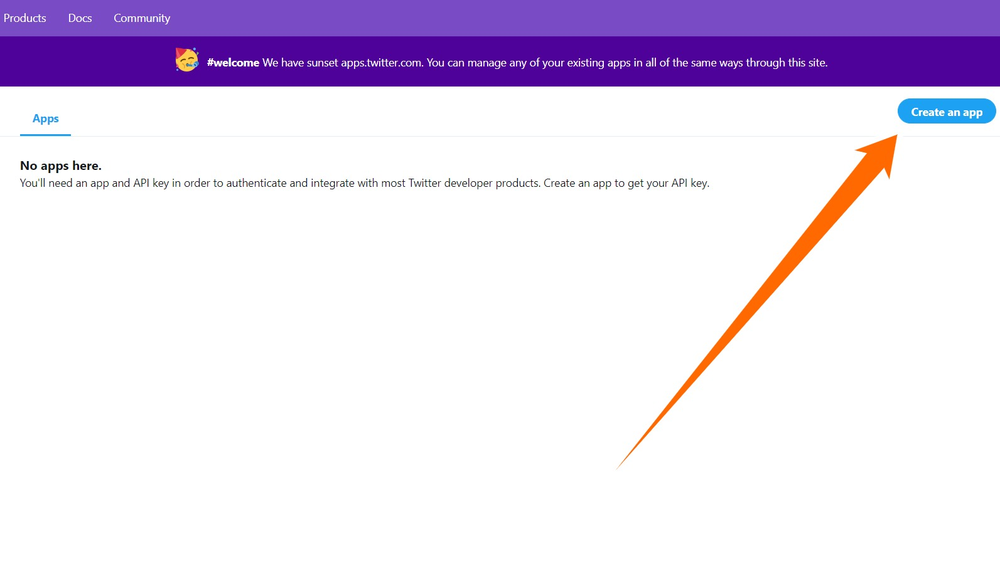
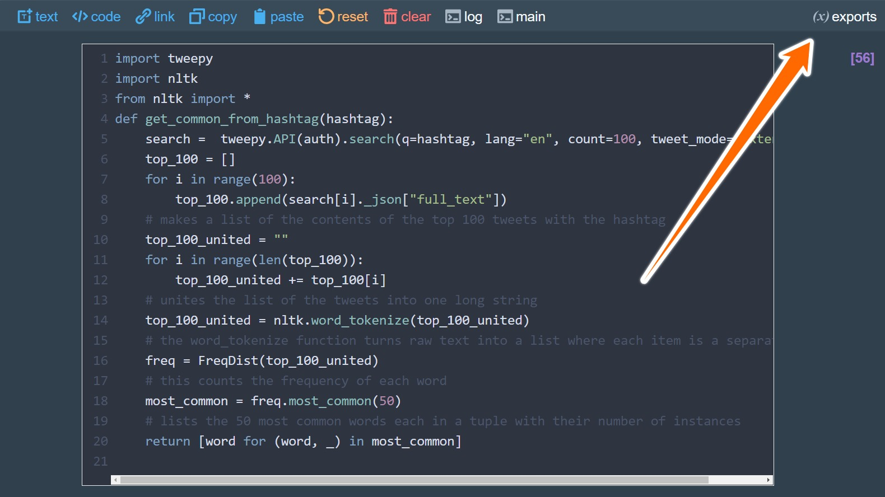
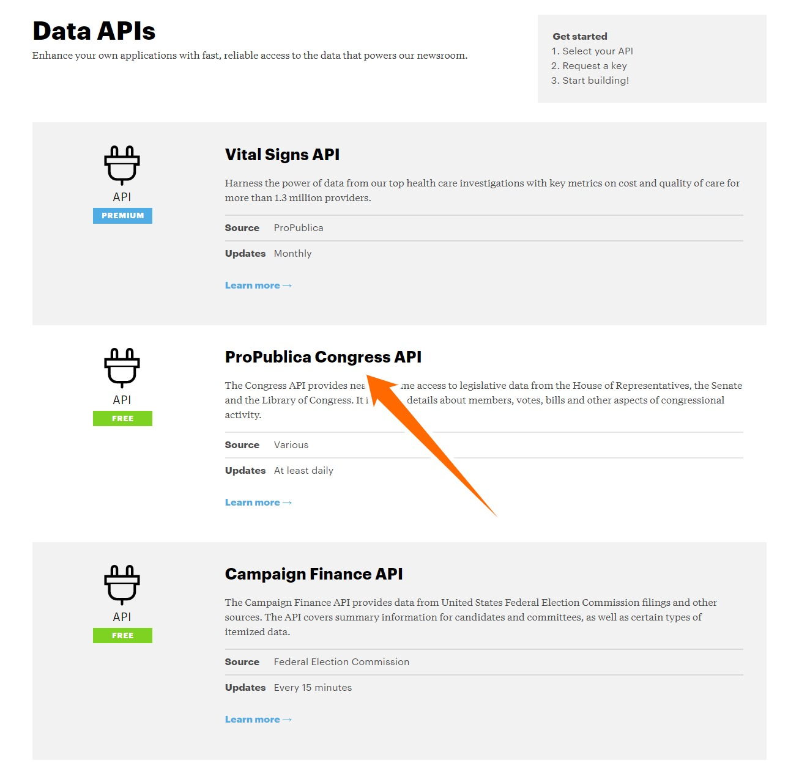
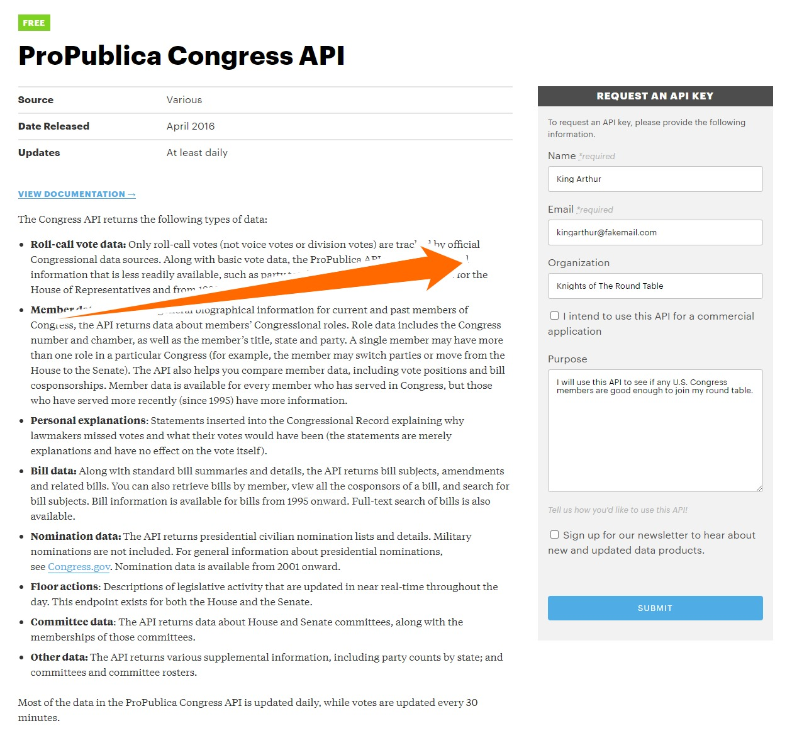
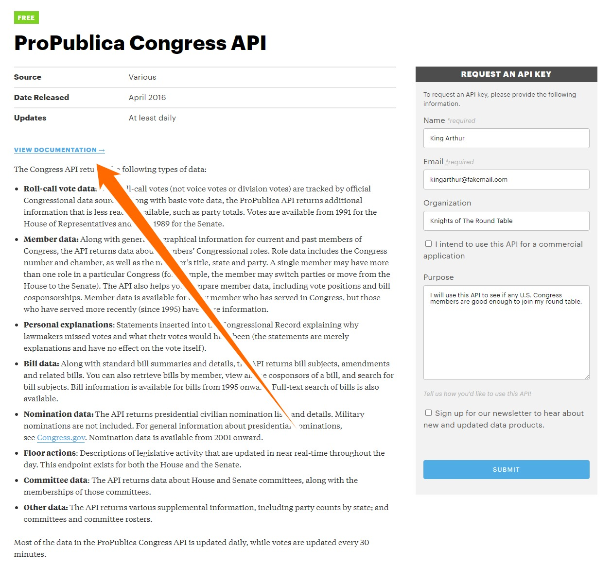
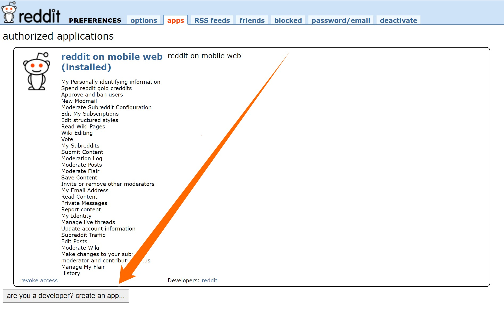
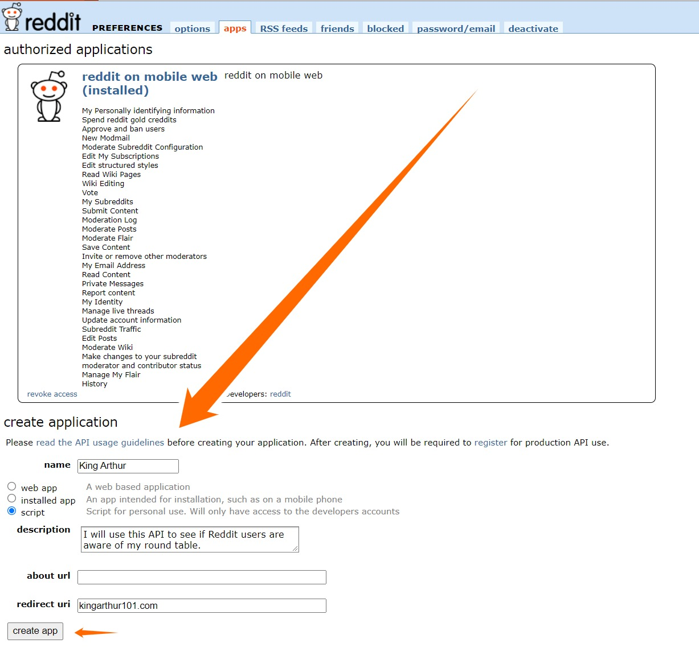
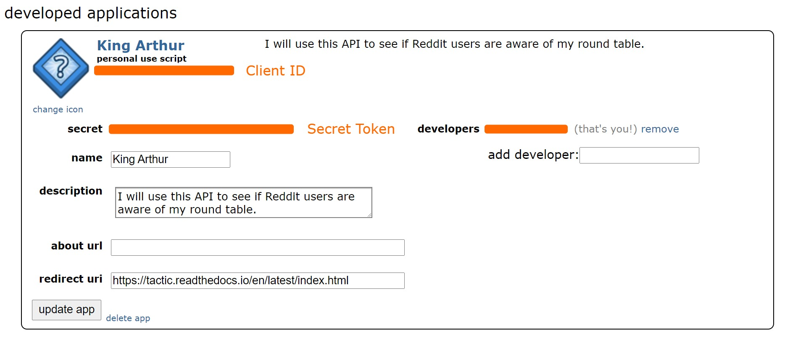

Getting Data From APIs
======================

This tutorial will walk you through getting data from some prominent online APIs.

Throughout the tutorial, I will be showing samples of code that I used in my notebook.
This notebook is accessible from the repository and has the name "getting_data_from_online_apis". If you don't know how
to access the repository, you can read about it on the `Getting Started <Getting-Started.html#first-steps-with-collections>`_ page.

In case you want more information afterwards, here's some links that were helpful to me while making this:

**Twitter:**
`Mining Twitter Data with Python <https://marcobonzanini.com/2015/03/02/mining-twitter-data-with-python-part-1/>`_ and `Extraction of Tweets using Tweepy <https://www.geeksforgeeks.org/extraction-of-tweets-using-tweepy/>`_

**Reddit:**
`How to Use the Reddit API in Python <https://towardsdatascience.com/how-to-use-the-reddit-api-in-python-5e05ddfd1e5c>`_

Twitter
-------

The first step in getting data from Twitter is going `here <http://apps.twitter.com>`_ and creating an app.
If you don't already have a developer account, you'll have to apply for that first.

Once you have created your app, make sure that you are back at the `Twitter apps <http://apps.twitter.com>`_ page and
select the "Details" button to the right of your app. Then, navigate to the "Keys and Tokens" section to get your API
keys and access tokens (I know, big surprise there). You will need these in a moment.

Now it's time to head over to `Tactic <https://tactic.northwestern.edu/>`_ and create a new notebook. We will be using
the library Tweepy, which you can read more about `here <https://docs.tweepy.org/en/stable/>`_.

In your notebook, execute these commands once::

    import tweepy
    consumer_key = "your_consumer_key"
    consumer_secret = "your_consumer_secret"
    access_token = "your_access_token"
    access_token_secret = "your_access_secret"
    # Creating the authentication object
    auth = tweepy.OAuthHandler(consumer_key, consumer_secret)
    # Setting your access token and secret
    auth.set_access_token(access_token, access_token_secret)
    # Creating the API object while passing in auth information
    api = tweepy.API(auth)

This is how you do a search::

    language = "en"
    query = "#Disneyland"
    results = api.search(q=query, lang=language, count=100, tweet_mode='extended')

.. note::

    If you don't use tweet_mode='extended' then the text of long tweets will be truncated.

This will return a list of a results. To extract the information you need, you'll want the ._json property.
This will give you a dictionary::

    post = results[0]._json
    post.keys() # look here if you want to access a different attribute of the tweet
    post["full_text"]

You just found the top tweet for #Disneyland, but how about you try to do something a little more complicated.
Let's say you wanted to make a table to look at the most common words tweeted with different MLB teams' hashtags.
This can be done with the help of Tactic and Tweepy along with two other libraries: pandas and NLTK. Pandas can be used
for turning a dictionary into a table, and NLTK has many useful commands for analyzing the text.

The first step is to make a function that returns the 50 most common words used in the top 100 posts containing a
particular hashtag::

    import tweepy
    import nltk
    from nltk import *
    def get_common_from_hashtag(hashtag):
        search =  tweepy.API(auth).search(q=hashtag, lang="en", count=100, tweet_mode='extended')
        top_100 = []
        for i in range(100):
            top_100.append(search[i]._json["full_text"])
        # makes a list of the contents of the top 100 tweets with the hashtag
        top_100_united = ""
        for i in range(len(top_100)):
            top_100_united += top_100[i]
        # unites the list of the tweets into one long string
        top_100_united = nltk.word_tokenize(top_100_united)
        # word_tokenize turns raw text into a list where each item is a separate token
        freq = FreqDist(top_100_united)
        # FreqDist counts the frequency of each word
        most_common = freq.most_common(50)
        # lists the 50 most common words each in a tuple with their number of instances
        return [word for (word, _) in most_common]

Now we can use this function to create a dictionary where each MLB team corresponds to a list of their 50 most common words::

    mlb_dict = {
        "cubs" : get_common_from_hashtag("#CubTogether"),
        "yankees" : get_common_from_hashtag("#SquadUp"),
        "pirates" : get_common_from_hashtag("#LetsGoBucs"),
        "diamondbacks" : get_common_from_hashtag("#RattleOn"),
        "cardinals" : get_common_from_hashtag("#STLFLY"),
        "reds" : get_common_from_hashtag("#ATOBTTR"),
        "white sox" : get_common_from_hashtag("#ChangeTheGame"),
        "marlins" : get_common_from_hashtag("#JuntosMiami"),
        "phillies" : get_common_from_hashtag("#phillies"),
        "royals" : get_common_from_hashtag("#TogetherRoyal")
    }

.. note::

    I'm pretty sure these hashtags change every season, so you'll need to look up what hashtags to use if you are
    reading this beyond the 2021 season.

You now are able to turn this dictionary into a table using pandas::

    import pandas as pd
    mlb_df = pd.DataFrame.from_dict(mlb_dict)
    # from_dict turns a dictionary into a dataframe

If you want to view your table, click on the "exports" button located in the top right of your notebook and then
select "mlb_df."

Lastly you can save your table to your library using the following code::

    ndoc = self.create_document(mlb_df, "mlb_common_words")
    ncol = self.create_collection_object("table", {"mlb_common_words": ndoc})
    ncol.add_to_library("mlb_common_words")

You now should be able to see your table in your library. Obviously, this isn't perfect, and we could add filters
to exclude tokens such as ! and $, but hopefully this gives you a general idea of how to use Tactic and Tweepy.

ProPublica
----------
ProPublica makes substantial data available for free with a few APIs. Before you can use any of these APIs, though, you
need to request a key. Luckily, it's very quick and easy:

First, visit the ProPublica APIs page `here <https://www.propublica.org/datastore/apis>`_ and click on one of the APIs you'd like to use (in
this example we will be using the Congress API).

Then, fill out the information under "request an API key" and click "submit."

Once you have your key, you can open up a Tactic notebook and run this code::

    import requests
    my_propub_key = "your_propub_key"
    headers = {'X-API-Key': my_propub_key}

Now you are ready to use the API. Using these commands you can get a dictionary with information about the 115th senate's members::

    propublica_query = "https://api.propublica.org/congress/v1/115/senate/members.json"
    first_request = requests.get(propublica_query, headers = headers).json()
    first_request.keys() # pretty much all the important info is in "results"

You can make a list of the members in this senate with the following code::

    members_list = first_request["results"][0]["members"]
    # This is a list of dictionaries
    # Each dictionary has information about a particular member of congress
    # We just want their name
    congress_members = []
    for i in range(len(members_list):
        congress_members.append(members_list[i]["first_name"]
                               + " " + members_list[i]["last_name"])
    # this iterates through each item in members_list and adds the congress member's name to the list
    congress_members[:10]

You can also access recent votes using this API::

    propublica_query = "https://api.propublica.org/congress/v1/house/votes/recent.json"
    second_request = requests.get(propublica_query, headers = headers).json()
    second_request["results"]["votes"][0].keys()

One nice thing about this API is that not only tells us the total vote, but it also tells us how many members of
each party voted in favor and against. So, you can do things like finding which votes got a substantial amount of bipartisan support::

    def find_if_bipartisan(vote):
    # find if both the majority Democrats and Republicans voted in favor
    if vote["democratic"]["majority_position"] == "Yes":
        dem_support = True
    if vote["republican"]["majority_position"] == "Yes":
        rep_support = True
    if dem_support and rep_support:
        return True
    else:
        return False

    votes = second_request["results"]["votes"]
    bipartisan_votes = [] # this will be our list of bipartisan votes
    for i in range(len(votes)):
        if find_if_bipartisan(votes[i]):
            bipartisan_votes.append(votes[i]["description"])

    bipartisan_votes

.. note::
    For me, only one vote (out of the 20 most recent votes that it gives you) turned out to be bipartisan, so it's very
    possible that bipartisan_votes returns an empty string and you didn't make a mistake.

There's a lot more you can do with these APIs, but this should be enough information for you to get started using Tactic
and ProPublica's APIs. You can read more about ProPublica's APIs by going `here <https://www.propublica.org/datastore/apis>`_, selecting the API that you are interested in,
and then clicking "view documentation."

Reddit
------

Reddit contains a massive amount of data, which in the right hands can be very useful. It can be a little tricky to
figure out at first, but once you get going it won't be too hard. The first step in using Reddit's API is registering for an
access token `here <https://www.propublica.org/datastore/apis>`_. At the bottom of the screen, select "are you a developer? create an app..."

Then, fill out the information below and click "create app."

Now you should be given your keys. Your client ID is located below the words "personal use script" and your secret
token is to the right of the word "secret."

Once you have your keys you can open up a Tactic notebook and enter the following code::

    import requests

    auth = requests.auth.HTTPBasicAuth('CLIENT_ID', 'SECRET_TOKEN')

    # here you pass your login information
    data = {'grant_type': 'password',
            'username': 'YOUR_ACCOUNTS_USERNAME',
            'password': 'YOUR_ACCOUNTS_PASSWORD'}

    # Creates your header which gives Reddit a little info about your app
    headers = {'User-Agent': 'YOUR_BOTS_NAME'}

    # sends a request for an OAuth token
    res = requests.post('https://www.reddit.com/api/v1/access_token',
                        auth=auth, data=data, headers=headers)

    # pulls access_token value from the request
    TOKEN = res.json()['access_token']

    # adds authorization to your headers
    headers = {**headers, **{'Authorization': f"bearer {TOKEN}"}}

.. note::
    The OAuth expires after about 2 hours and at that point you'll need to request a new one and update your headers.

Now that you have set up your authorization, you are ready to send requests. You can get "hot" posts from a
subreddit, such as r/science, using this request::

    res = requests.get("https://oauth.reddit.com/r/science/hot",
                       headers=headers, params = {"limit": 40})
    # the limit param allows you to search for more than 25 posts
    # the maximum number of posts you can search for is 100

Then you can create a list of the posts' titles on the subreddit::

    for post in res.json()["data"]["children"]:
    print(post["data"]["title"])

If you want to access the text of a post by its index, you can also do that::

    res.json()["data"]["children"][0]["data"]["selftext"]

However, a lot of posts on r/science are links, which will not contain any text.

There is another subreddit called r/AskScience; this subreddit's posts are mostly questions about science. Let's see
if there are any common words used in the titles. Just like in the Twitter tutorial, you will be using the NLTK library::

    import nltk
    from nltk import *

    res = requests.get("https://oauth.reddit.com/r/askscience/hot",
                       headers=headers, params = {"limit": 100})

    posts_text = ""
    for post in res.json()["data"]["children"]:
        posts_text += post["data"]["title"].lower()
    # creates one long string combining the titles of the 100 posts

    tokenizer = Library.functions["bruces_alpha_only"]
    # Tactic allows you to save code samples to your account and access them later
    # you can view these samples and add more on the code tab of the Tactic library
    # every Tactic account automatically has some code samples added to it
    # one of these code samples, bruces_alpha_only, turns a string into a list of words

    posts_tokenized = tokenizer(posts_text)
    # turns the string into a list of tokens contained in a list
    posts_tokenized_filtered = []
    stopwords = Library.lists["stop-words_english_1_en.txt"]
    # all Tactic accounts have a few lists automatically added to their account
    # you can view these lists and add more on the lists tab of the Tactic library
    # stopwords is a list of insignificant words like he, she, the, it
    for token in posts_tokenized:
        if token not in stopwords:
            posts_tokenized_filtered.append(token)
    # removes some of the non-word characters and insignificant words from the list
    freq = FreqDist(posts_tokenized_filtered)
    # FreqDist counts how many times each word in a string occurs
    freq.most_common(20)
    # returns the 20 most common words in freq

There is a whole bunch of stuff that you can do with the Reddit's API that I couldn't include. If you want to read more
about it, you can view its documentation `here <https://www.reddit.com/dev/api/>`_.

Wikipedia
---------

Unlike the other APIs used in this tutorial, you do not need a key or access token to use Wikipedia's API. So, you can
go straight into a Tactic notebook and run this code to set up your API::

    import wikipediaapi
    wiki_api = wikipediaapi.Wikipedia(
            language='en', # articles will be in English
            extract_format=wikipediaapi.ExtractFormat.WIKI # we want the wiki format of the article
    )

Then, you can access the text of an article, such as the `List of United States political catchphrases <https://en.wikipedia.org/wiki/List_of_United_States_political_catchphrases>`_, like so::

    article_title = "List_of_United_States_political_catchphrases" # you have to use underscores instead of spaces

    catchphrase_wiki = wiki_api.page(article_title) # gets the article but in wiki format
    catchphrase_txt = catchphrase_wiki.text # gets the text out of the wiki formatted article
    catchphrase_txt[:1000]

If you wanted to extract the quotes from the whole text of the article, you could do so using the library re (short
for regular expressions). Re allows you to create an expression that describes the pattern of a string to the computer.
For instance, you might want to tell the computer, "Please go through this text and find every instance of a quotation
mark followed by some number of characters and then another quotation mark." However, this can get a little more complicated
because the computer might look at a quotation mark and also classify that as one of the characters that comes before
a quotation mark. The expression you can use to represent this is \\".+?\\". The \\" at the start and end represent that
the string starts and ends with a quotation mark. You only need to use the backslash so the quotation mark isn't read as
the end of the string. The . represents every character (except for newline) and then the + means one or more instances
of that dot can occur. In this situation, the ? represents that the .+ is not "greedy." This means that instead of
reading a second quotation mark as one of the instances of the .+, it is read as the second \\" which is what you want.
Here's the regular expression in action::

    import re
    catchphrases = re.findall("\".+?\"", catchphrase_txt)
    # finds every instance of the regexp in catchphrase_txt and stores it in catchphrases
    for phrase in catchphrases:
        print(phrase)

Regular expressions are incredibly useful for extracting data from long bodies of text. If you want to learn more about
them, you can read their documentation `here <https://docs.python.org/3/library/re.html>`_. Also, if you want to read more about Wikipedia's API you can do so `here <https://pypi.org/project/Wikipedia-API/>`_.