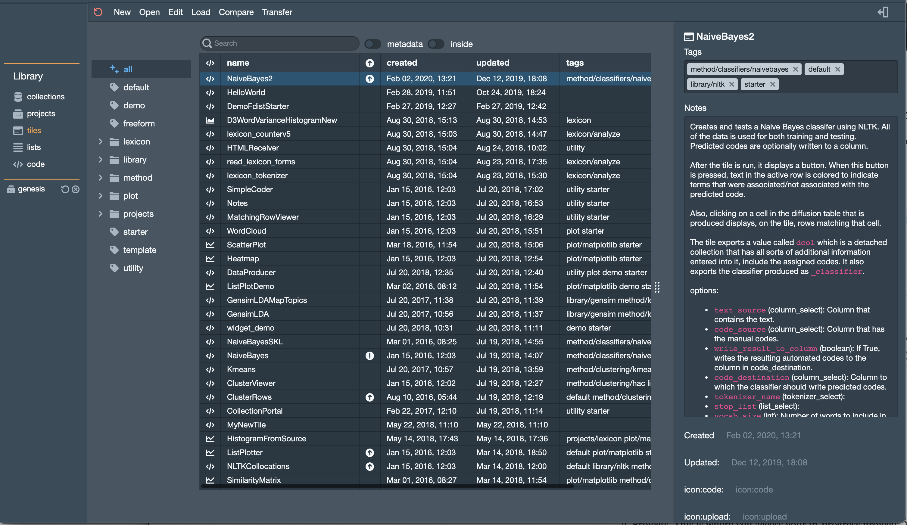

Library Interface
===================

This Library interface is what you see when you use to manage the resources in your library,
such as the data you upload, and the tiles you create or import. It is also from here that you can launch viewers
and editors of those resources. Here it is, with the :guilabel:`Tiles`  pane selected.

Here's a little tour:

The sidebar
-------------

There are four Library panes accessible from the sidebar on the left, each one corresponding to one of the categories of resources.
They are, from top to bottom:

1. Data Collections. This is your raw data.
2. Projects. This is where you access your in-progress projects. You can also create new notebooks here.
3. Tiles. Your tile modules.
4. Lists. Your lists, obviously.
5. Code resources. These are explained a bit `here. <Working-With-Code-Resources.html>`__

The menubar
-------------

Across the top is each library pane is a menubar with a number of menus These differ in function depending on
what resource you are managing. I think these will mostly be self-explanatory.
They do things such as let you view a resource, delete it, combine resources, etc.

The tag tree
--------------

Just to the right of the sidebar is the tag tree. You can learn more about how this tree gets populated
`here. <Working-With-Tags.html>`__ Clicking on a tag in the tree filters the list of resources you see in the table.

One thing that might not be obvious is that you can :kbd:`Right-Click` (or :kbd:`Control-Click`) on a tag to get
a context menu that will let you edit or delete a single tag.

The central table
---------------------

This is where you view your list of resources. You can select a resource here.

You can also select multiple rows. A subset of the toolbar functions can operate on multiple resources.
Also, you can edit the metatdata for multiple
resources in this way. This is useful, for example, to set a bunch of resources to have the same tags.

You can type in the search field above the table to filter the list of resources. Also, for some resource types,
there are switches that allow you to search :guilabel:`inside` a resource or search the :guilabel:`metadata`
associated with resources.

You can also :kbd:`Right-Click` (or :kbd:`Control-Click`) on a row in the table to access a context menu. The available
functions replicate a subset of the functions available in the menubar.

The omnibar
-------------

Typing :kbd:`Ctrl-Space` brings up the omnibar. Start typing to select from a list of resources in the current tab.
Then press enter to select and view a resource. All hail the awesome `omnibar. <https://blueprintjs.com/docs/#select/omnibar>`__

The metadata editor
---------------------

Finally, on the ride side of the library interface is a panel where you can view and edit the metadata associated with
the selected resource.

Keyboard shortcuts
---------------------

Actually, I forgot something else. There are a few handy keyboard shortcuts in the Library:

:kbd:`Tab`

    Cycle forward through the sidebar panes. (For these purposes, the Libray is treated as a single pane.)

:kbd:`Shift-Tab`

    Cycle backward through the sidebar panes.

:kbd:`Arrow-Up`, :kbd:`Arrow-Down`

    Move the selected row up or down.

:kbd:`space`, :kbd:`enter`

    View the selected resource.

:kbd:`Ctrl-Space`

    Show the omnibar.
