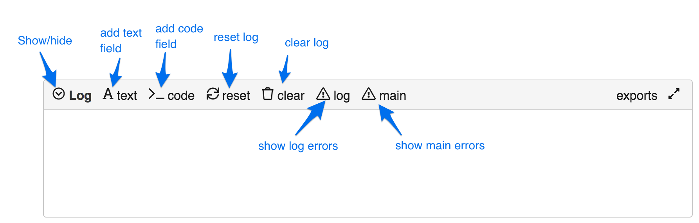
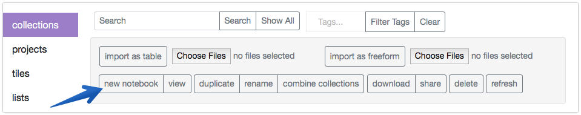
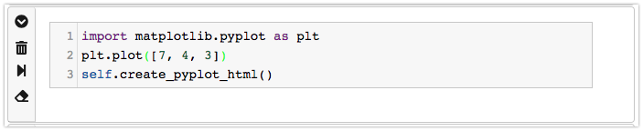

The Log and Notebook
====================

As mentioned in the section on the `Main Interface <Main-interface.html>`__,
there is a component at the bottom of the screen called the Log. Tiles
can send information to the Log, and some error messages will show up
there. The Log is also designed to be used more like a full-fledged
python notebook.

Furthermore, you can also create projects that consist of nothing more
than a Notebook of this sort. There are two ways to create one of these
Notebook projects. First, from within the Main Interface, you can go to
the Project menu and select :guilabel:`open-console-as-notebook`. This will
start a Notebook project using the correct contents of the Log (but will
not copy internal state).

The second way to create a Notebook project is from the collection
manager. Just click the :guilabel:`new notebook` button as as shown in the figure
below.

.. figure:: images/new_notebook.png

Logs and Notebooks pretty much work the same way. You use the buttons at
the top to manually add new elements:

Text fields
-----------

You can create a text field by clicking the :guilabel:`text` button. You’ll get
something that looks like this:

|image2|

You’ll notice three buttons on the left of the field. The top one
shrinks and expands the field. The middle one deletes the text field
entirely. Clicking the bottom button causes the contents to be
interpreted as markdown:

|image3|

Clicking the bottom button again toggles the display back to plain text.

Code fields
-----------

You create a code field by clicking the :guilabel:`code` button:

|image4|

The top two buttons here do the same thing as for text fields. The two
new buttons execute the code and clear any output that was generated on
previous runs.

In many ways, code fields in Logs and Notebooks function like a tile.
You can write any code that you can write in a tile, which means you can
test code here, and that you have access to the whole tile API.
(However, some of these commands won’t make sense in Notebooks.)

Any local variables you introduce within a code field are added to the
global namespace. This means that these variables shared across the code
fields in your Log/Notebook.

Like a tile, output here is treated as html. So you might need to add
html tags to get the output that you want. For example, you might want
to wrap your output in ``<pre>..</pre>`` tags.

You can display plots in the console just as you’d expect. But you have to use the
same magic commands as in a tile. So it’s a little ugly:

|image5|

You can also work with the Matplotlib interactive mode if you use the ``self.create_pyplot_html()``
magic command:

|image6|

Some final generalities
-----------------------

You can **reorder** fields by dragging on the button panel on the left
of any field.

About the :guilabel:`reset` button:

Clicking the reset button does a few different things:

-  It deletes any error messages that were automatically added to the
   Log.
-  It clears the output area of any code tiles.
-  It stops and restarts the python process so that the internal state
   is entirely cleared.

About the :guilabel:`clear` button:

Clicking the clear button button does everything that reset does, and
it also removes absolutely everything from the log.

About the **log and main errors** buttons:

These log errors button shows the container log for the virtual tile associated with the log.
The main errors button shows the container log for the container associated with the current project.
Tactic tries to catch all errors and to display them for you in the log, or in alerts. But if you
are getting unexpected behavior, and not seeing any normal error messages, then you can try looking at
the container logs to get a sense for what's going on. Problems with docker itself might also show up here.

About log item **summaries**:

When you shrink a log item, you will see the "summary" for the item.
The summary can be specified in the ``log_it`` command that creates a log item.
You can also directly edit the summary after shrinking a log item.

About **saving**:

When you save a standard project or notebook, Tactic attempts to save both
the appearance *and internal state* of the Notebook. The saving of internal
state is still an iffy business however.

.. |image2| image:: imgs/06ca6226.png
.. |image3| image:: imgs/a6aa511c.png
.. |image4| image:: imgs/55cbd9bd.png
.. |image5| image:: imgs/59bba4c7.png

