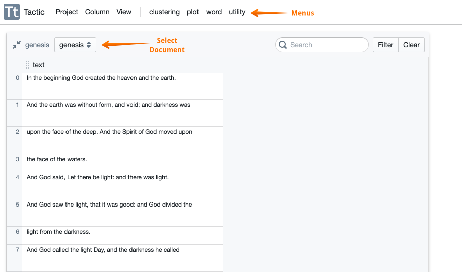
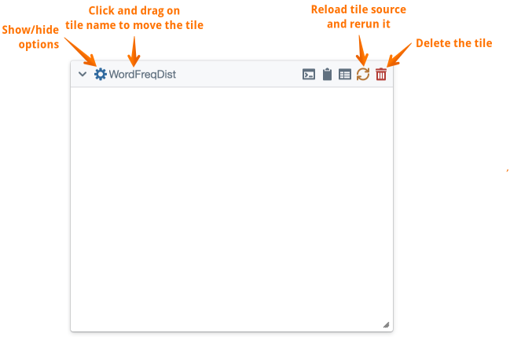
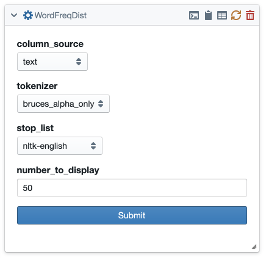
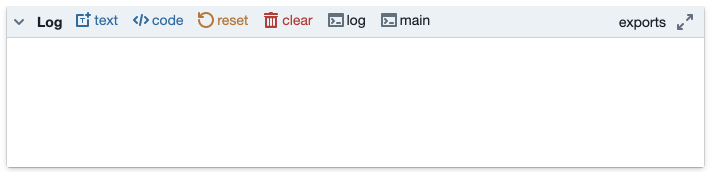
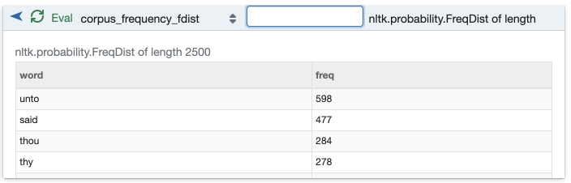

The Main Interface
==================

The top parts
-------------

The helpfully-titled “Main” interface is where you do the real work with
Tactic. It’s what you see when you open a data collection or a project.
There is a menu bar at the top. The :guilabel:`column menu` can be used to hide
columns, add new columns, or reorder columns. Note that hiding columns
doesn’t delete them, and selecting :guilabel:`unhide` from the column menu will
make all hidden columns reappear. Hidden columns are also available to
tiles.

You can also reorder columns by clicking in the header and dragging left or right.

Use the :guilabel:`Project` menu to save the current state of a project. You can
also export the data table in a few different ways: (1) you can export
it as a data collection back to your library, (2) you can export the
visible document as a CSV file on your local machine, and (3) you can
export all of the documents to an excel file.

The :guilabel:`Project` menu also has a an option :guilabel:`change_collection` which lets
you swap out the data collection in the main data table.

There are some useful buttons at the top of the panel that holds the
table. In the top-left corner is a button that shrinks the entire table
down to a single small icon. This gives you more space to work with
tiles. There’s also a popup for selecting which document will be
visible, and some search buttons.

You can resize and reorder columns. You
can also change the area available for the table to display by clicking
at the right edge of the table. This doesn’t resize the table, it just
hides part of it.

Other stuff you can do with the table: To select a row, click on the row number on the far left.
You can also edit a cell in the table by first double-clicking on the cell.

Working with tiles
------------------

The other menus at the top of the main interface allow you to created
analysis tiles. From the :guilabel:`word` menu, you can select the :guilabel:`WordFreqDist`
option to create a tile.

If you then click on the :guilabel:`show/hide options` button, you’ll see the
options for this tile. Fill these in and click submit to run the tile.

.. note::

    If you don’t see any choices in the tokenizer menu, go back to
    your library, to the :guilabel:`code` tab, and copy some tokenizers from the
    repository. Another note: In the :guilabel:`list` tab of you resource library,
    you can also copy some additional word lists from the repository, as
    well as create your own.

There are also buttons at the top of a tile. If you mouse over them, you'll see
a tooltip with a short explanation. But some of these need some
explanation. The :guilabel:`show tile container log` button displays, within the
tile, the log of the docker container within which the tile runs. This
will show everything that is written to stderr or stdout. If you use a
``print`` statment the output will appear there. (It’s unfortunate that
the word “log” means something different in this case.)

The :guilabel:`send current display to log` button writes a version of the tiles contents to the
log, which is visible at the bottom of the main interface. This will be
a copy of the tile’s html unless the programmer of the tile has
implemented an overriding method to write something different. (This is
explained in the part of the documentation on creating tiles.)

The :guilabel:`Send current parameters to log` button displays, in the log at the bottom of the
screen, a table containing the values of the various options, as
specified on the back of the tile.

The :guilabel:`Reload tile from source` button refreshes the tile, but it does so by
grabbing the current version of the code from the library. Then it
reruns the tile, keeping the values of options the same. This is
intended for the situation in which you are making changes to a tile’s
code, and then wanting to rerun it to see the effects. There’s a special
case: If the set of options has been changed, then the tile isn’t rerun.
Instead, the options panel is displayed so you can enter values for any
new options. Clicking submit at that point reruns the tile with the new
code.

You can reposition tiles by clicking and dragging on the tile's name at
the top. You can also resize tiles by clicking and dragging in the lower
right-hand corner.

The Log in brief
----------------

At the bottom of the main interface, on the left, is the log. The top of
the log looks like this. Nice, huh!

As mentioned above, if you click the log button on a tile, then the tile
will send some sort of information to the log. That’s useful for
tracking what you’re doing over time. The top of the Log has a button
the can be used to add an editable text field to the bottom of the
console. Note that the content of the Log is saved when a project is
saved.

You can also use the log something like a python notebook. There’s more
about the the log and the standalone notebook
`here <Log-And-Notebook.html>`__.

The Exports Viewer
------------------

At the bottom of the main interface, on the right, is the exports
viewer. (To see it, click on the  :guilabel:`Exports` button at
the top right of the log.) It is possibly the most useful thing in the entire universe. If
you have read about tiles, you’ll recall that tiles can declare that
some of their variables are available for access by other tiles via
pipes. In order to figure out what’s going on in a project, it’s often
helpful to be able to poke around inside these exported variables.
That’s what the exports viewer allows you to do.

The figure above shows the exports viewer with one export display.
There’s a popup list that lets you select which variable you want to
view. To actually see it’s contents after selecting it, you have to
click the :guilabel:`Eval` button. The refresh button at the top left refreshes
what you see in the heading of the panel. This might be necessary, for
example, after running the tile in which the selected export appears.
Note that you might still need to click Eval to see the most current
contents of this export.

The text box in the heading allows you to further specify how the
variable is evluated.

