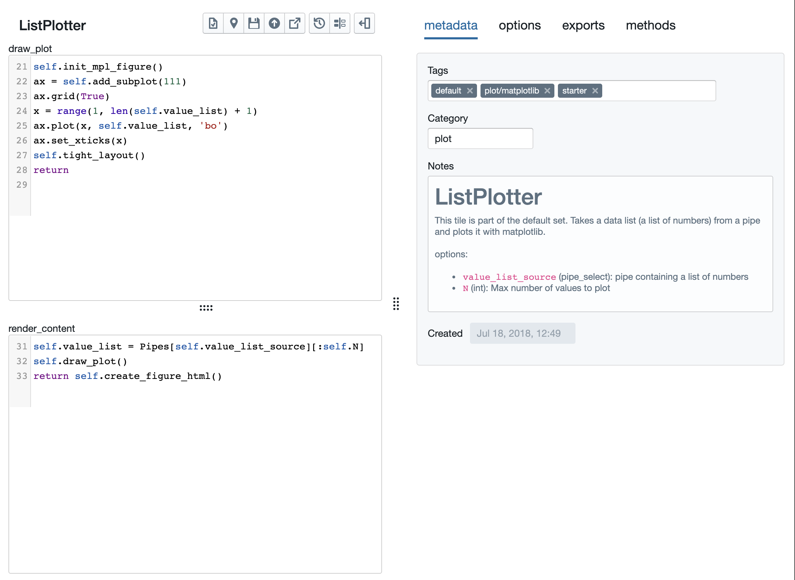

Matplotlib Tiles
================

Tactic includes support for building tiles that display matplotlib
images.

The `Tile Creator <Tile-Creator.html#creating-matplotlib-tiles>`__ knows how
to deal with MatplotlibTiles. This is what that looks like.

Unlike other tiles, matplotlib tiles are subclasses of both
``TileBase`` and ``MplFigure``. ``MplFigure`` is a subclass of
matplotlib’s ``Figure`` class.

In addition to defining a ``render_content`` method, every matplotlib tile
must define a method ``draw_plot`` that draws directly into the tile instance
as it would a matplotlib figure. ``render_content`` can do other work,
but it must call ‘draw_plot’, and then ‘create_figure_html’ to generate
the html for the tile. Note that ‘draw_plot’ will also be called each
time the user resizes the tile. Note that ‘draw_plot’ will also be called each
time the user resizes the tile.

In most cases, you’ll want the first line of ``draw_plot`` to be
`self.init_mpl_figure() <Tile-Commands.html#plots>`__. This initializes
the Figure class and must be called at least once before drawing into
the Figure. If you draw into the Figure without initializing again then
you’ll be adding to an existing figure. So, since ``draw_plot`` is
supposed to redraw the figure for new conditions (i.e., a new tile size)
you’ll normally want to reinitialize at the top of ``draw_plot``.

Matplotlib Tiles and Dark Theme
-------------------------------

Matplotlib tiles can look ugly if you're using the Tactic dark theme.
If, like me, you are bothered by such things, you can write your tile so
that it automagically uses different colors depending on the theme.
Adding this code to your ``draw_plot`` method *should* do it, but it doesn't quite.
Note that I've created a matplotlib style called "tactic_dark" that is specifically
designed for the Tactic dark theme.

.. code:: python

    import matplotlib.pyplot as plt
    use_dark = Settings["theme"] == "dark"
    if use_dark:
        plt.style.use('tactic_dark')
    else:
        plt.style.use('default')

However, I find that when I add this to my tiles, the output doesn't look quite right
when I first run it. Resizing the tile seems to fix it. You can play around with setting
colors manually to get perfect behavior, if you want. The commands you'll want
are things like ``self.patch.set_facecolor("#5c7080")`` and ``ax.set_facecolor("#5c7080")``.

Raw Code for a Matplotlib Tile
-----------------------------

In case you're in interested in such things, this is what the same tile
looks like viewed in the `Module Viewer <Module-Viewer.html>`__.

.. code:: python

    @user_tile
    class ListPlotter(TileBase, MplFigure):
        category = "plot"
        exports = []

        def __init__(self, main_id, tile_id, tile_name=None):
            TileBase.__init__(self, main_id, tile_id, tile_name)
            self.save_attrs += [exp["name"] for exp in self.exports]
            self.value_list_source = None
            self.N = 20
            return

        @property
        def options(self):
            return  [
            {"name": "value_list_source", "type": "pipe_select"},
            {"name": "N", "type": "int"}
            ]

        def draw_plot(self):
            self.init_mpl_figure()
            ax = self.add_subplot(111)
            ax.grid(True)
            x = range(1, len(self.value_list) + 1)
            ax.plot(x, self.value_list, 'bo')
            ax.set_xticks(x)
            self.tight_layout()
            return

        def render_content(self):
            self.value_list = Pipes[self.value_list_source][:self.N]
            self.draw_plot()
            return self.create_figure_html()
