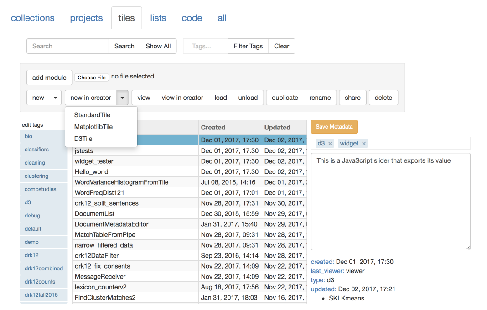
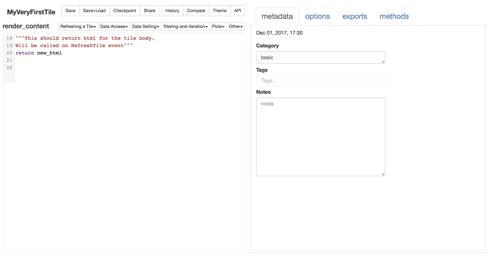
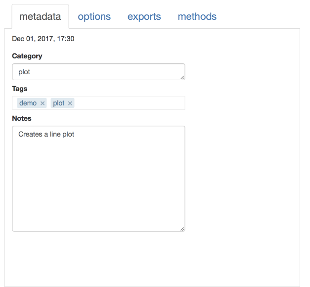
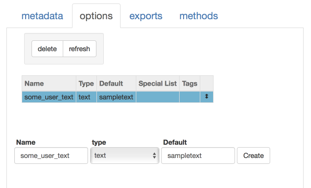

The Tile Creator
================

The Tile Creator is the editor that provides a more scaffolded
environment for creating and editing tiles. As explained in the
`introduction to making tiles <Making-Tiles.html>`__, **the tile creator is
new and can garble existing tiles**. So, use it with care. When editing
an existing tile you might want to first make a copy of the tile.

Creating the new tile
---------------------

With that said, here’s how to create a new tile with the creator:

Go to the :guilabel:`tile` tab of your resource library and click :menuselection:`new in creator --> StandardTile`.

|image0|

When prompted give your tile some sort of useful name. Then you should
see something that looks like this:

|image1|

Writing the tile body
---------------------

The large box on the left-hand side is where you write the code that
will be the ``render_content`` method in your new tile. In short, what
you need to understand is that this bit of python code must return the
html that will be displayed in your tile. Thus, the last line in the box
should be a ``return`` statement.

So, for example, if you change the content of the box to be:

.. code:: python

    new_html = "hello world"
    return new_html

Then you will have a tile that simply prints “hello world” on its face.

Remember that the text you display can be any valid html and will be
displayed as such. So, for example, if you instead write this:

.. code:: python

    new_html = "<b>hello world</b>"
    return new_html

Then you’ll instead have a tile that display “hello world” in bold text.

In writing your tile, you have access to a number of tactic-specific
commands that, for example, give you access to your data. These are
described in some detail here: `Tile Commands <Tile-Commands.html>`__. There
is also some help pertaining to these commands built into the Creator
window. If you click on :guilabel:`Show API` at the top of the Creator view the
resource area will be replaced by a compressed version of the command
documentation. Also, at the very top of the big box for typing your code
are popup lists that contain the tile commands. These paste the relevant
command directly into your code.

You can use these `Keyboard Shortcuts <Module-Viewer-Keyboard-Shortcuts.html>`__ within the box
containing your code.

Finally, typing :kbd:`ctrl-space` while in the code area brings up the
autocomplete widget. This will prompt you with various useful
possibilities, including the Tile Commands

You can also import and make use of a number of `scientific libraries <Tile-commands.html#available-libraries>`__.

Go to the relevant web sites for documentation on these libraries.

Specifying tile resources
-------------------------

The area on the right-hand side of the interface allows you to create
and edit various resources and metadata for your tile.

|image2|

metadata
~~~~~~~~

The :guilabel:`metadata` is where you specify a bit of metadata for your tile.
The “Category” field determines the menu under which your tile will
appear in the main project environment.

options
~~~~~~~

The :guilabel:`options` tab is where you specify `Tile
Options <Tile-Structure.html#options>`__ that will appear on back of your
tile. Here I have clicked on the options tab and then used the form at
the bottom to create an option called ``some_user_text``.

|image3|

These option can now be referred to in the tile code as
``self.some_user_text``. So if you then change your code to be:

.. code:: python

    new_html = "<b>" + self.some_user_text + "</b>"
    return new_html

There are many different types of options as described here: `Tile
Options <Tile-Structure.html#options>`__. there’s an extra step required in
making use of some of these options (``list_select``, ``pipe_select``,
``function_select``, ``class_select``). In these options, the variable
you get contains only the name of the selected resource. To extract the
value you have to use one of the tile commands described
`here <Tile-Commands.html#other>`__. For example
``self.get_user_list(list_name)`` returns the actual list referred to.

exports
~~~~~~~

You can also specifythe name of variables that will be :guilabel:`exports` for
your tile. (Exported variables are available as pipes to other tiles.
Note that these must be instance variables assigned values in your code
in this manner ``self.variable_name =  ...``. )

methods
~~~~~~~

The :guilabel:`methods` tab displays additional methods defined within a tile
class. This is for advanced users. But if you use the tile creator to
look at existing tiles they will often have methods that are visible
here. You can define new methods that will be accessible in your tile.
For example, you could define a method ``my_method`` like so:

.. code:: python

    def my_method(self, avar):
        return myvar + 2

All methods that you define need to have ``self`` as the first argument.

Creating Matplotlib Tiles
-------------------------

You can use the Tile Creator to make tiles that display matplotlib
figures. If you open an existing matplotlib figure or create a new one
from your resource manager, then the Tile Creator opens with a slightly
different interface. Rather than having one large box for code on the
left, there are two. The bottom one holds the code for the
``render_content`` method. The other holds the code for the
``draw_plot`` method, which all matplotlib tiles must have.

This is explained a bit `here <Matplotlib-Tiles.html>`__.

Creating D3 Tiles
-----------------

You can also use the Tile Creator to make tiles that display interactive
D3 figures. If you open an existing D3 figure or create a new one from
your resource manager, then the Tile Creator opens with a slightly
different interface. Rather than having one large box for code on the
left, there are two. The bottom one holds the ``render_content`` method.
The top one holds a javascript function which must be of the form:

.. code:: javascript

    function (selector, w, h, arg_dict) {
    }

Also, ``render_content`` must return a dictionary of arguments that will
be passed to the javascript function in ``arg_dict``.

This is explained a bit `here <D3-Tiles.html>`__.

