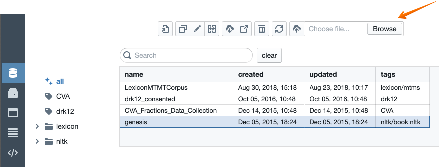

Uploading Data
--------------

You can upload one of your own datasets. There are two modalities
available for datasets, “table” and “freeform.” Freeform datasets
consist of a set of unstructured text documents. Table datasets consist
of a set of tables of data.

To upload data, go to the collections tab of your user library. Click
“choose files” from the right end of the toolbar. Then select some files.

.. note::

    You can select any number of files and these files will be loaded as documents within a single
    collection.

For table collectons, data must be in the form of xlsx, csv, tsv, or
plain text (txt) files. The first row of an xlsx, csv, or tsv file must
contain the headers for the columns. Data in a txt file is treated as a
series of rows of text with rows separated by newlines. If multiple
files are selected, each of the files is treated as a separate document
within the collection. If an xlsx file with multiple sheets is selected,
each sheet is treated with as a separate document. It’s okay to mix and
match file types.

After choosing the files, import button. You’ll
be prompted for a name for your new collection. You'll also have the option to specify
that you want the file to be imported as a freeform document, rather than a table.
After you hit return, the name of your new collection should appear in the list below.

Tactic will try to make its best guess as to the encoding of the file.
If it runs into any decoding problems, it will let you know.

