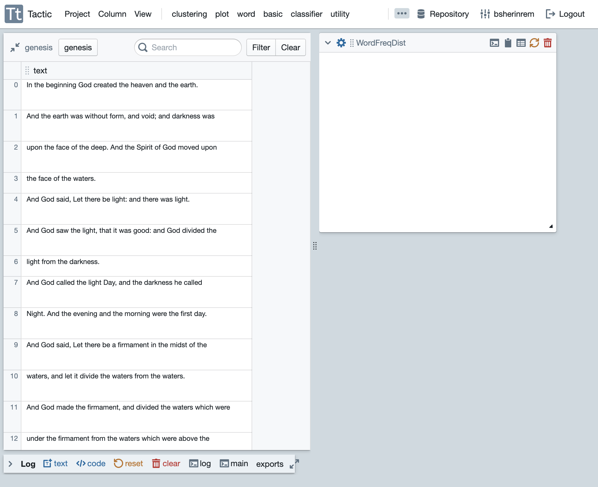
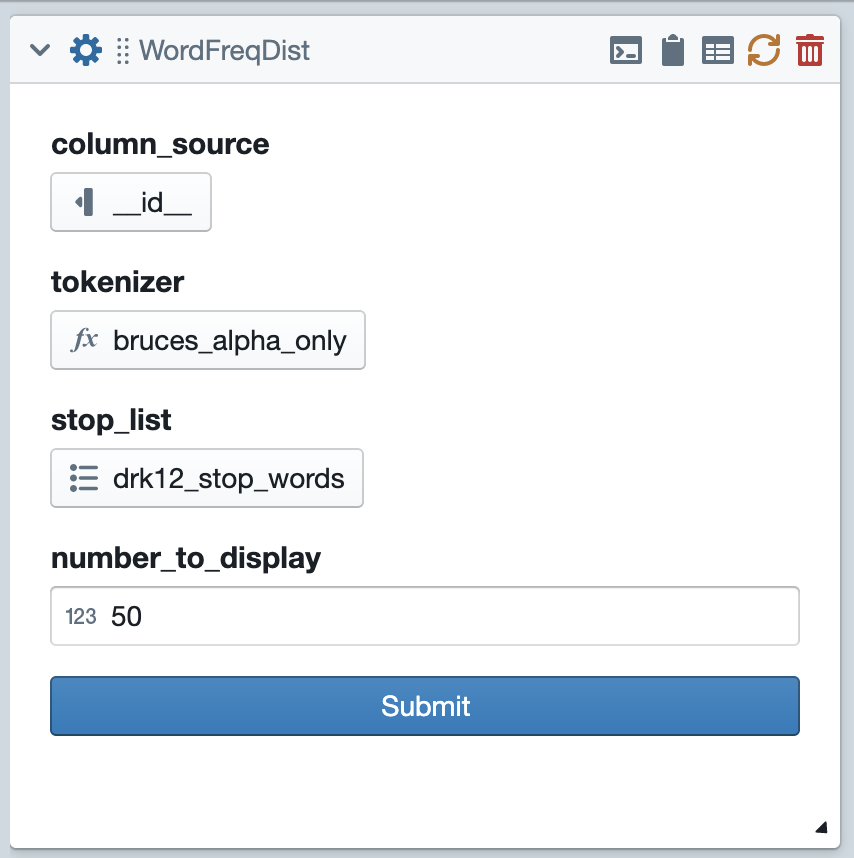
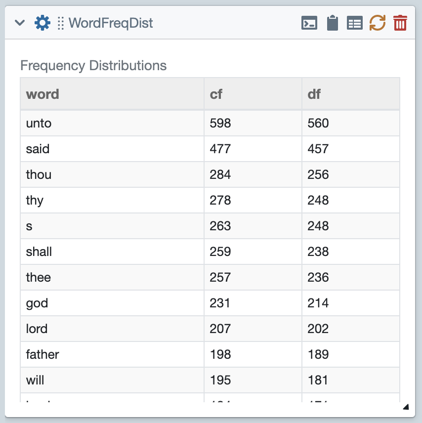
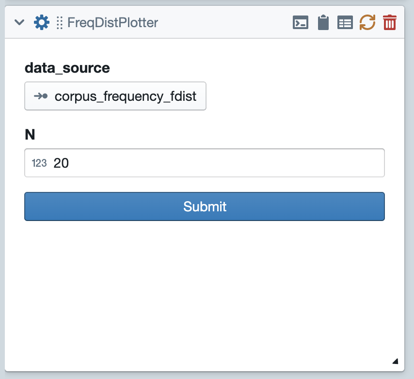
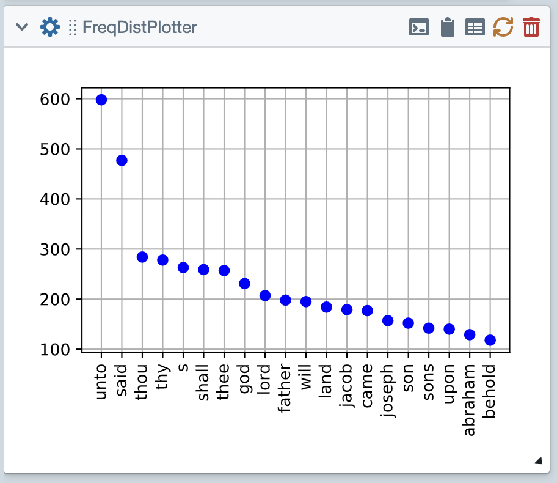
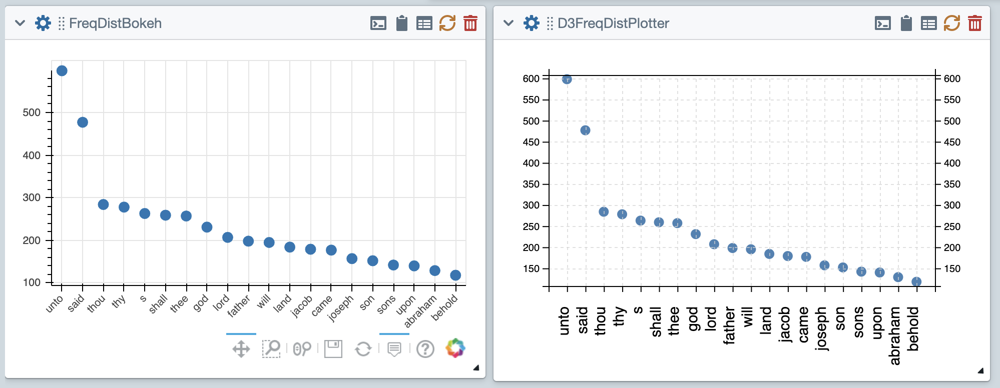

Use Existing Tiles
====================

This quick tutorial will walk you through starting a project using existing tiles.
If you haven't already done so, you might want to first go through `Getting Started <Gettting-Started.html>`__ and
the `Main Interface <Main-Interface.html>`__.

Start by going to the collections pane of your library and loading the genesis collection. Then go to the
:guilabel:`word menu` and create a WordFreqDist tile. The WordFreqDist tile's purpose is to count and display the
frequencies of individual words in the collection.

Setting Options
---------------

Now click on the gear icon to flip over the tile and expose its options.

Next you'll want to click on each of the three options and set it appropriately. The first option,
:guilabel:`column_source` is a column_select option. For that option, you'll want to select the column named
"text," since that is the column that has text we want to process.

The :guilabel:`tokenizer` option is a function_select
option; it allows us to select a function from our code resources. In this case, the choices have been narrowed
by the tile's creator to only include code resources with the "tokenizer" tag. For this one I'm going to select
"bruces_alpha_only" because it's my personal favorite tokenizer. The last option is a list_select option; it lets
you select one of the list resources from your library. In this case the list will be used as a stop list. This
is a list of words that will be ignored by our analysis. I'm going to select "stop-words_english_2_en.txt".

After making all of these choices, you can slick the :guilabel:`submit` button, and the tile will do its work.
The results should look something like this.

Piping Data Between Tiles
-------------------------

Now comes the even more exciting part. In addition to displaying these frequencies on the front of the tile
the WordFreqDist tile also saves the results internally (as NLTK Frequency distributions) and exports them.
Other tiles can then access them as pipes.

Now we'll plot the data from WordFreqDist. Drop in a FreqDistPlotter tile from the :guilabel:`plot menu`. As shown in
in the figure below, this tile has two options. The first is a pipe_select option. This type of option allows you
to select an attribute that is exported by another tile. If you click on this option, you'll see that there are only
two choices, corresponding to the two frequency distributions exported by WordFreqDist. Select one of these.

The second option is just an integers, which specifies how many data points to plot. If have entered 20, which
will lead the tile to plot the data corresponding to the 20 most frequent words. Go ahead and click submit. The
results should be a plot something like this:

Plotting with other libraries
-----------------------------

The above FreqDistPlotter tiles uses the MatPlotLib library to produce the plot.
Tactic includes other libraries that you can use to draw plots. The tile FreqDistBokeh uses
the Bokeh library to produce the plot. It's easier to add interactive properties to Bokeh. If you want
to try this yourself, you'll first have to go back to the tiles pane of your Library, then highlight the FreqDistBokeh
tile and click the load button to load it. Then you can add the tile from the plot menu.

Similarly, D3FreqDistPlotter uses D3 to produce the plot. D3 is a javascript library, which means Tactic
has to do include special mechanisms for the production of D3 plots. You can read `here <D3-Tiles.html>`__.

Saving your project
-----------------------------

When you're all done, you can save your project by going to the :guilabel:`Project menu`. Once you've done so,
you can reload this project from the projects pane of your library.