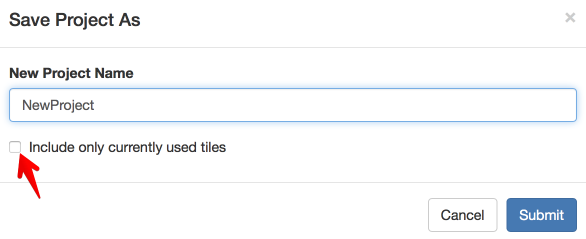

Tile Availability
=================

I’m not sure if this page has the right title, but here’s the deal.

If you open up a project window, before explicitly loading any tiles
from your library, the tile menus will be populated with a small
collection of tiles. These tiles are drawn from the tile *repository*.
More specifically, it includes all of the tiles from the repository that
have the tag “default.”

Next, suppose you go to your tile library and click :guilabel:`load` to load a
tile. Immediately, the tile menus in every open project window will be
updated to include the new tile. The new tile is available universally,
across all of your open projects.

If you load a tile, and an existing tile has the same name, then the old
tile will be overwritten. But note: The name of a tile comes from the
name of the tile class, not the name of the module. It has to be this
way since it’s possible to have multiple tile classes inside a module.

If you go to your tile library, and click :guilabel:`unload`, this will unload
all of the tiles that you previously loaded.

This has an impact on what happens if you **save a project.** By
default, when you save a project, the project makes a note of all of the
tiles that are open in the user environment. Then, if the project is
loaded some time later, it will make sure that all of these tiles are
available in the user environment. If they are not, it will load them.
Note that it finds the tiles by name in your library, it does not use a
saved version of the tile code.

However, you can change some of this default behavior on a per-project basis.
When you first save a project, you will get a dialog that looks like
this:

|image0|

If you click the check box “Include only currently used tiles,” then
only the tiles actually used in the current project will be included in
the list of tiles to be loaded whenever the project is loaed.

Suppose you **edit a previously loaded tile** in the module viewer, then
click “save and load.” In that case, any new versions of this tile will
have the new version of the code. Existing tiles will not be modified.
However if you click the refresh icon at the top right of a tile (just
to the left of the trash can), then the tile will refresh itself using
whatever current version of the code is. When it does this, it will
assume that the options and their values stay the same. If an edit to
the tile’s code changed the options, then the refresh button will cause
the tile to display the options for you to edit before running the tile.

