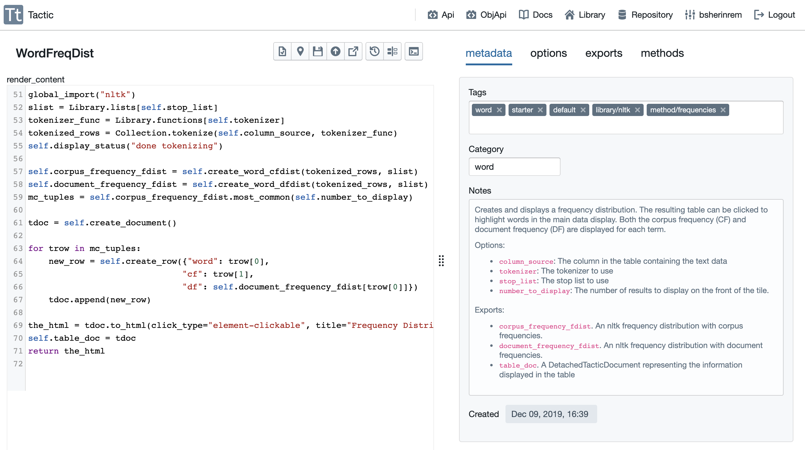
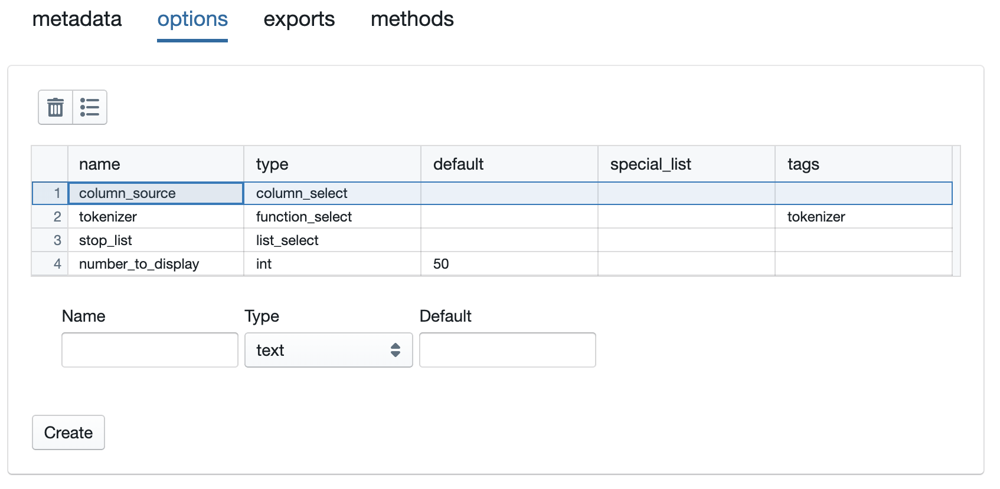
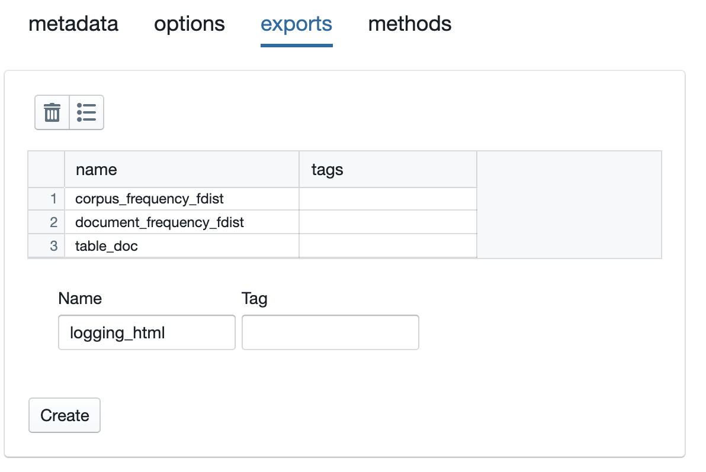
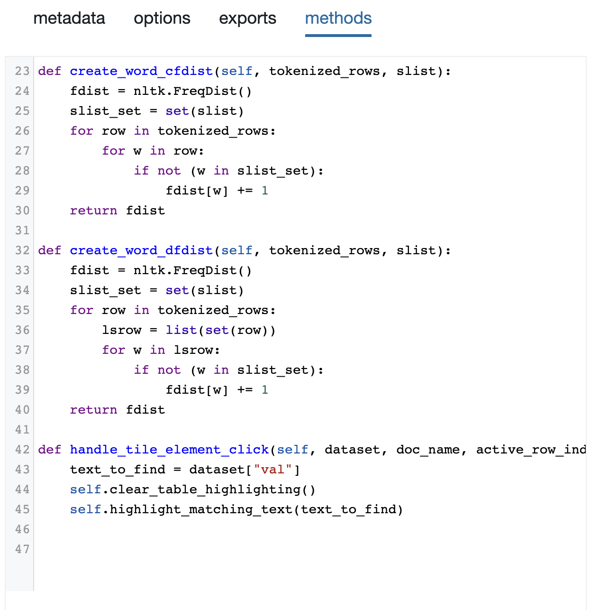
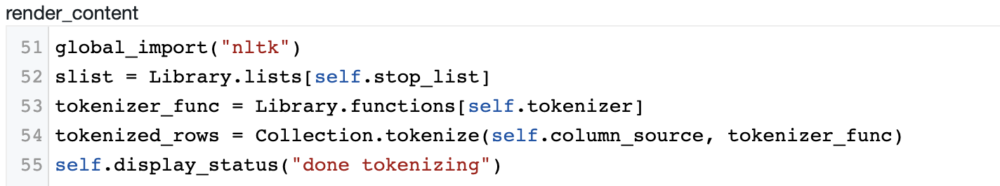
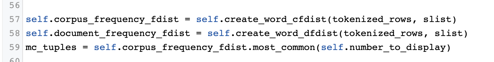
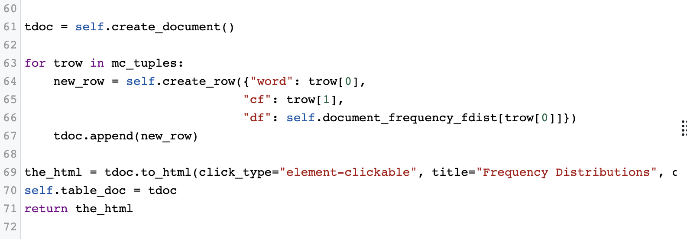

WordFreqDist Explained
======================

In `Use Existing Tiles <Use-Existing-Tiles.html>`__. I walked you through how to plunk down and run a couple of tiles
(WordFreqDist and FreqDistPlotter). In `Create A Simple Tile <Create-Simple-Tile.html>`__ I showed you how to use
the Tile Creator to create an extremely simple tile.

In this tutorial, I'm going to walk you through the details of one real-world tile, the WordFreqDist tile, in gory detail.
So, the first step is to go to the tiles pane of your library and open WordFreqDist in the Tile Creator.

To fully understand WordFreqDist, we're going to have to examine the contents of the ``render_content`` method, which
is visible on the left in the image above. We are also going to have to click on each of the tabs on the right, and
look at what they do. Let's start with the tabs on the right, since that's easier.

Metadata
--------

First, the metadata. Most of this should be self-explanatory. The tags and notes are the same tags and notes you
can edit in the library. The tags help you in organizing you set of tiles. In addition, two of the tags here are
special: (1) Any tile with a "default" tag is automatically loaded when you log in; (2) The "starter" tag indicates
this is a tile that is automatically provided to each user when their account is created.

There is one important piece of metadata that you cannot edit from the library, the category. The category specifies
which menu your tile will appear under in the main view. Here we see that WordFreqDist is assigned to the
:guilabel:`word menu`.

Options
--------

Now let's look at the options.

There are four options defined here, each with a different type.

-  *column_source*. This is a column_select option, which means that the user will be able to select from the a
   list of the columns in the table. When the tile is run, ``self.column_source`` will contain the name of the column
   selected.
-  *tokenizer*. This is a function_select option, which means the user will select from a list of the functions
   that exist in their code resources. Furthermore, note that the functions presented will be restricted to functions
   that have the tag "tokenizer", since I have entered that in the tags associated with this option. When the tile
   is run, ``self.tokenizer`` will give us access to the *name* of the function, not the function itself. In order to
   access the function, we will have to either write ``self.get_user_function(self.tokenizer)`` or
   ``Library.functions[self.tokenizer]``.
-  *stop_list*. This lets the user select a list from among the lists in their library. Again, when the code is run,
   we will ``self.stop_list`` will contain the name of the list, not the list itself. ``Library.lists[self.stop_list]``
   will give us the list.
-  *number_to_display*. The user can enter an integer here that we will use to determine how many results to display
   on the front of the tile. This will start with the default value of 50. When the tile is run ``self.number_to_display``
   will contain the integer entered.

Exports
--------

Here's the exports pane:

Here we have specified that three attributes will be exported by this tile. Note that ach of these must be created as
attributes of the tile. What this means practically is that we need to assign
values to them like this: ``self.corpus_frequency_fdst = ...``.

It is probably clear why we want to export the two frequency distributions, since those are the attributes that will
likely be used by other tiles, as we saw `here <Use-Existing-Tiles.html>`. But one additional thing to keep in mind
is that the attributes specified as exports are also the attributes that will be saved when a project containing the
tile is saved. It is solely for this reason that ``logging html`` appears here as an export. We want to store this
attribute across saves since the tile needs it if a user tries to send the tile's display to the log, by clicking
the appropriate button at the top of the tile. There's a bit more about this below.

Methods
--------

Finally, here's the methods pane:

The methods pane is where we can define additional methods that can be called from the ``render_content`` method,
or from other methods defined on the methods pane. These are essentially just extra functions you can define. But
they need to have `self` as their first argument, and they will have access, through `self`, to the tile API.

I'll discuss the specific methods here below.

render_content, in detail
-------------------------

Okay, now let's get into the guts of this thing. Here are the first few lines of ``render_content``.

You'll notice that the first line is line 51. There's a good reason for this, and it's something worth understanding.
When you edit a tile when the tile_creator, what you're actually editing is a version of the tile that has been
cut up into pieces for you. However, before the tile is actually run, the pieces will be assembled into one long
block of code - a class definition for the tile you are defining. In this case, when the pieces are assembled,
the first line of ``render_content`` will, it turns out, be line 51 of the tile definition.

This matters for the following reason: When you get error messages about your tile, those messages will refer, by
line number, to the code in your tile. So, it helps greatly to have the lines numbered properly in the Tile Creator.
Please appreciate this, since this alignment was difficult to achieve.

So ``render_content`` begins, in Line 51, by importing the natural language toolkit library. Normally, you would do
this with the simple line ``import nltk``. However, if you do that, then the import will be local to ``render_content.``
This means that, if you want to use nltk in any of the methods defined on the methods pane, you'll have to include a
a line in those methods to import nltk. But tactic provides the special ``global_import`` function that lets you import
libraries in a way that makes them globally available.

Line 52 grabs the full stop list from the user's library, in the manner described above. Similarly, Line 53 grabs
the function that will be used as a tokenizer.

Line 54 does the first real work. It uses the ``tokenize`` method of the `Collection` object, which is
:py:class:`TacticCollection` object corresponding to the Collection loaded in the main environment.
This tokenizes each of the cells in the column specified in ``self.column_source``, using the specified tokenizer.
It returns the result as a list, with one entry for each row.

Line 55 displays the html "done tokenizing", on the front of the tile, so that the user knows what we're doing.

The next few lines do the actual work of computing the `NLTK frequency distributions <http://www.nltk.org/api/nltk.html?highlight=freqdist>`.

Line 57 computes corpus frequencies by calling one of the methods defined in the methods pane. Line 58 does the same
for document frequencies. (Note that, as discussed above, both of these are assigned to instance attributes,
so that they can be exported.) Line 59 uses the ``most_common`` method of nltk.FreqDist to grab the most frequent
entries from ``self.corpus_frequency_fdist``. The result is a list of tuple, with each tuple containing a word and
the number of occurrences of that word. Note that we have specified that ``most_common`` should return a number
of results equal to ``self.number_to_display``.

Now we have all of the information needed; we have done all of the analysis we are going to do. Now we need
to turn the results into some neat html that can be displayed on the front of the tile. There are many ways
we could do this. In this case, I first turn the results into a :py:class:`DetachedTacticDocument` object. Then
I take advantage of the capability of that type of object to represent itself as an html table. Here are the final
lines of render_content, which do that:

Line 61 creates the :py:class:`DetachedTacticDocument`. Then I loop over ``mc_tuples``, creating a
:py:class:`DetachedTacticRow` corresponding to each tuple, and adding it to the documnet. Using the TacticDcoument
machinery is probably overkill. But it's not really harder than building a plane old list of lists or list of dicts.

Now that we have built the document, we can use the ``to_html`` method of a :py:class:`DetachedTacticDocument` to
represent it as html. This is the html we return in Line 71, and that will be displayed on the front of the tile.
Before doing that, however, Line 70 did one last piece of business. It assigns the document we
constructed to the instance variable ``self.table_doc``, so that we can export this document. This is probably
pointless, but it's a least possible that we might want to access this document from another tile.