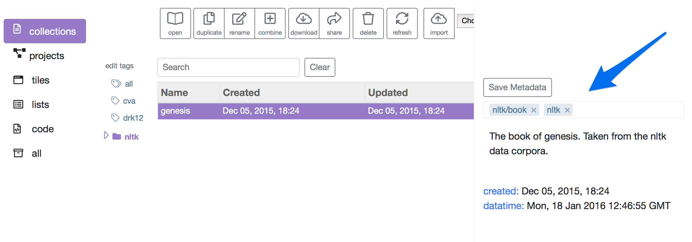
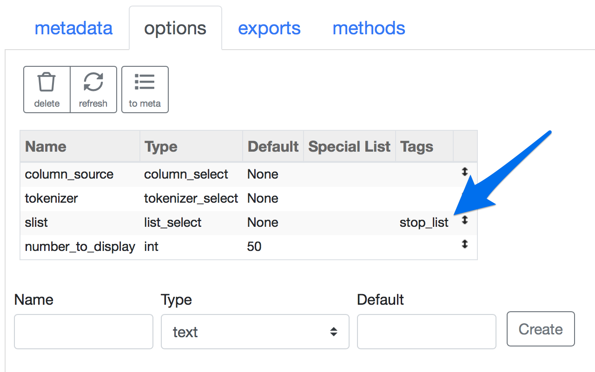
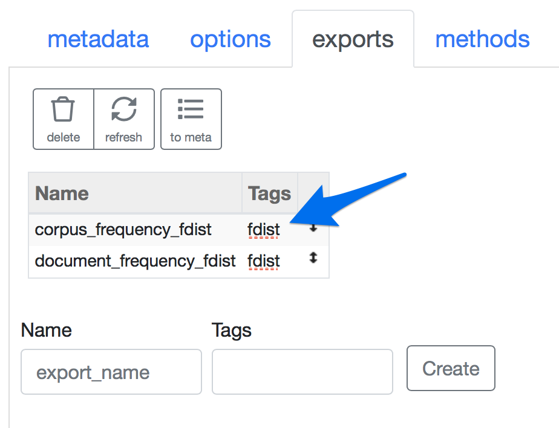

Working With Tags
====================

Tags perform a couple of important functions in Tactic.
Firstly, they provide a means of organizing your resources. Second, they permit you to narrow which resources
are made available in selection lists presented in the options lists on the back of tiles.

Using tags in resource lists
----------------------------

The primary way in which you assign tags to to resources is via the tags field that appears on the right when you are
viewing your resource library.

Clicking on the image of a tag on the left causes the viewer to
only show resources with that tag.

Nested tags
-----------

Notice how, in the above image, the genesis colleciton has "nltk/book" as a tag.
When a "/" appears in a tag, it is treated as a nested tag. In this case, the book
tag is now a tag within the nltk folder, and that relationship is reflected in the tag list
on the left. You can have as many layers of nesting as your like.

Note that "nltk" can still function as a tag in its own right.

Using tags in tile options and exports
--------------------------------------

For tile options that present a selection list to the user, you can specify tags.
If you do, the selection list will be narrowed to resources that match the tags.
For example, if you create an option of type list_select, and you specify the tag "stop_list",
then the user will only see lists with the stop_list tag when selecting a list on the back of the tile.
The image below shows what this will look like in the Creator.

You can also assign tags to tile exports. Then if tags are assigned to a pipe_select option, the user
will only see exports that match the tag.

