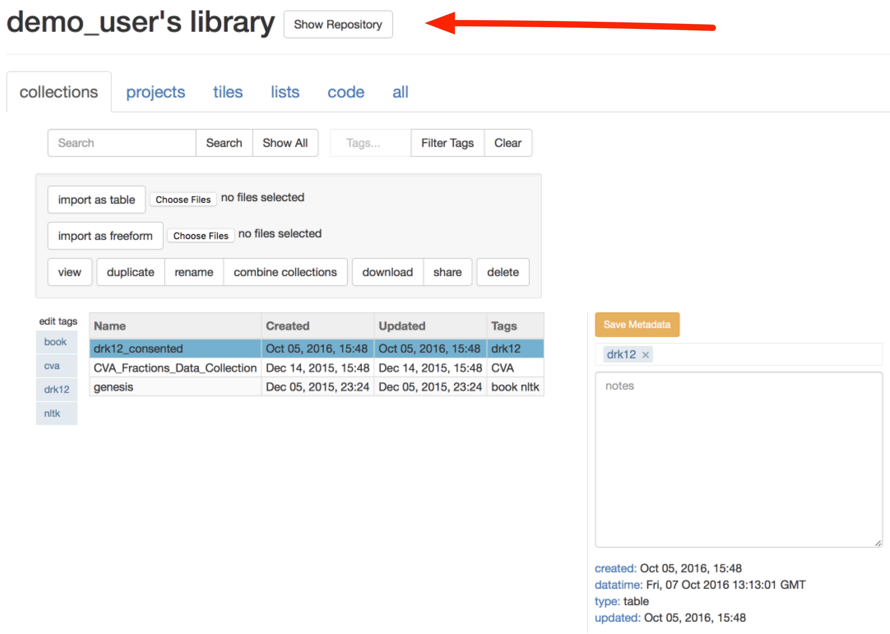
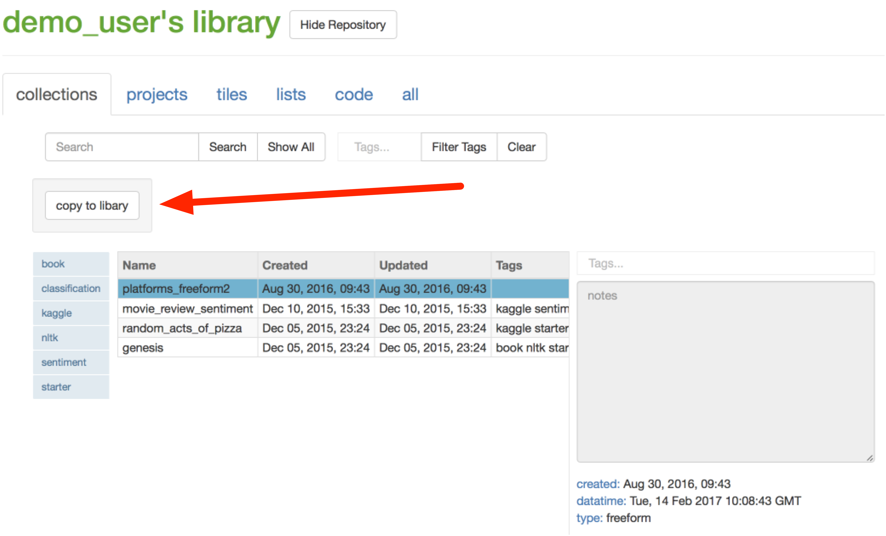

review
# Getting Started

## Creating your first collection

After you log in, you should be taken automatically to the resource management page. To get started using tactic, 
you need to load in some data. Your libary should already have some collections loaded. To view one of these 
collections, select it in the list and click the blue "view" button. (You can also double_click directly on the item.) 
A new web browser tab should open and you should see a table (or freeform document) with your data.

If you want, you can also explore additional sample collections available in the repository, 
which provides resources that can be used anyone. 

Click "Show Repository". This will allow you to see resources in the repository.

Select one of the data collections from the list that appears. 
Click "Copy to Library" and the collection will be added to your own personal library.

Finally, click "Hide Repository" again to go back to your own library.

Alternatively, you can [upload one of your own datasets](Uploading-Data)

Also, before you try to do anything, you should head over to the "code" tab your resource library and make sure there
are some tokenizers there. If there aren't, import some of the tokenizers from the repository.

## Working with your collection

If you haven't already loaded a collection, do that. Then head over to the [Main interface](Main interface) 
section of the documentation.