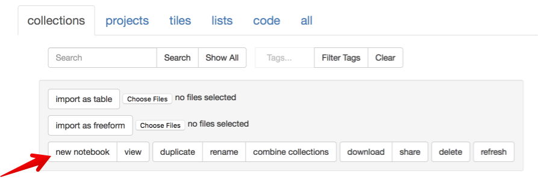
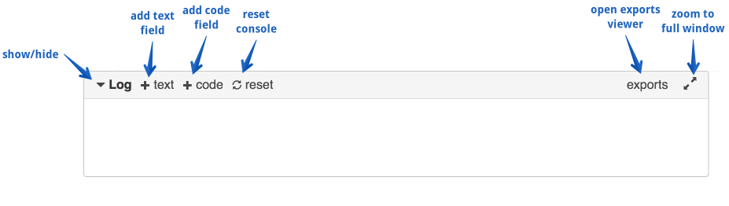
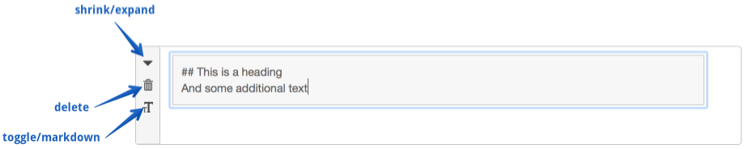
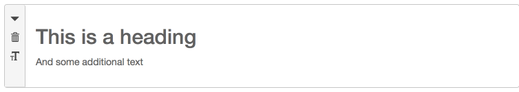
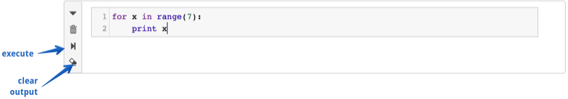
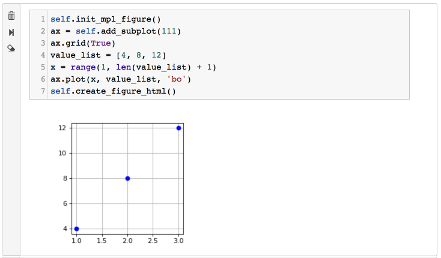

# The Log and Notebook

As mentioned in the section on the [Main Interface](Main-interface), there is a component at the bottom of the screen
called the Log. Tiles can send information to the Log, and some error messages will show up there. The Log is also designed
to be used more like a full-fledged python notebook.

Furthermore, you can also create projects that consist of nothing more than a Notebook of this sort. There are two ways
to create one of these Notebook projects. First, from within the Main Interface, you can go to the Project menu
and select **open-console-as-notebook**. This will start a Notebook project using the correct contents of the Log 
(but will not copy internal state).

The second way to create a Notebook project is from the collection manager. Just click the **new notebook** button as
as shownin the figure below.

Logs and Notebooks pretty much work the same way. You use the buttons at the top to  manually add new elements:

## Text fields

You can create a text field by clicking the **+text** button. You'll get something that looks like this:

You'll notice three buttons on the left of the field. The top one shrinks and expands the field. The middle one
deletes the text field entirely. Clicking the bottom button causes the contents to be interpreted as markdown:

Clicking the bottom button again toggles the display back to plain text.

## Code fields

You create a code field by clicking the **+code** button:

The top two buttons here do the same thing as for text fields. The two new buttons execute the code and clear any output
that was generated on previous runs.

In many ways, code fields in Logs and Notebooks function like a tile. 
You can write any code that you can write in a tile, which means you can test code here, 
and that you have access to the whole tile API. (However, some of these commands won't make sense in Notebooks.)

Any local variables you introduce within a code field are added to the global namespace. This means that
these variables shared across the code fields in your Log/Notebook.

Like a tile, output here is treated as html. So you might need to add html tags to get the output that you want. 
For example, you might want to wrap your output in *pre* tags.

You can display plots in the console just as you'd expect. At the present time, to do so, 
you have to use the same magic commands as in a tile. So it's a little ugly:

## Some final generalities

You can **reorder** fields by dragging on the button panel on the left of any field.

About the **reset** button:

Clicking the reset button does a few different things:

* It deletes any error messages that were automatically added to the Log.
* It clears the output area of any code tiles.
* It stops and restarts the python process so that the internal state is entirely cleared.

About **saving**: 

When you save a standard project, the Log is saved as pure html. That means that it will *look* the same
when you open the project. But the state of the Log is not saved; none of the variables you have defined are saved.

However, when you save a Notebook project, Tactic attempts to save both the appearance *and internal state* of the
Notebook.