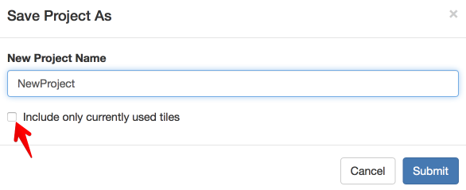

# Which tiles are available when

I'm not sure if this page has the right title, but here's the deal. 

If you open up a project window, before explicitly loading any tiles from your library, the tile menus will be 
populated with a small collection of tiles. These tiles are drawn from the tile _repository_. 
More specifically, it includes all of the tiles from the repository that have the tag "default."

Next, suppose you go to your tile library and click **load** to load a tile. Immediately, the tile menus in every open 
project window will be updated to include the new tile. The new tile is available universally, across all of your open projects.

If you load a tile, and an existing tile has the same name, then the old tile will be overwritten. 
But note: The name of a tile comes from the name of the tile class, not the name of the module. 
It has to be this way since it's possible to have multiple tile classes inside a module.

If you go to your tile library, and click **unload**, this will clear all of the tiles that you loaded.

This has an impact on what happens if you **save a project.** 
By default, when you save a project, the project makes a note of all of the tiles that are open in the user environment. 
Then, if the project is loaded some time later, it will make sure that all of these tiles are available in the user 
environment. If they are not, it will load them. Note that it finds the tiles by name in your library, 
it does not use a saved version of the tile code.

However, you can change this default behavior on a per-project basis. When you first save a project, you will get
a dialog that looks like this:

If you click the check box "Include only currently used tiles," then only the tiles actually used in the current
project will be included in the list of tiles to be loaded whenever the project is loaed.

Suppose you **edit a previously loaded tile** in the module viewer, then click "save and load." In that case, any new 
versions of this tile will have the new version of the code. Existing tiles will not be modified. However if you 
click the refresh icon at the top right of a tile (just to the left of the trash can), then the tile will refresh 
itself using whatever current version of the code is. When it does this, it will assume that the options and their 
values stay the same. If an edit to the tile's code changed the options, then the refresh button will cause the tile
to display the options for you to edit before running the tile.